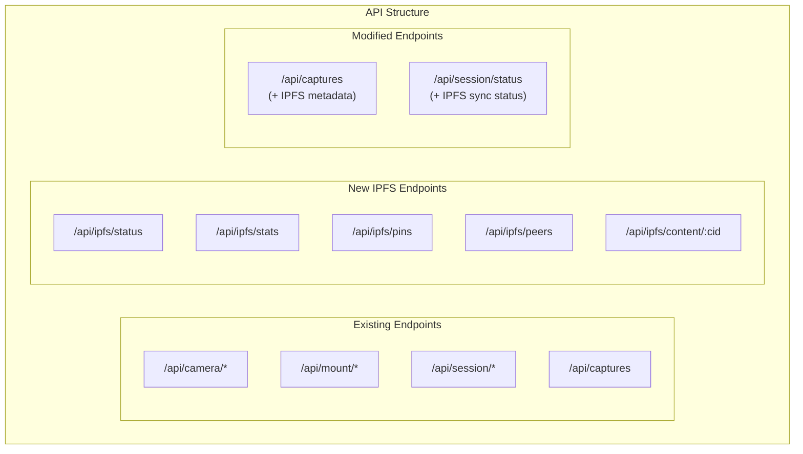
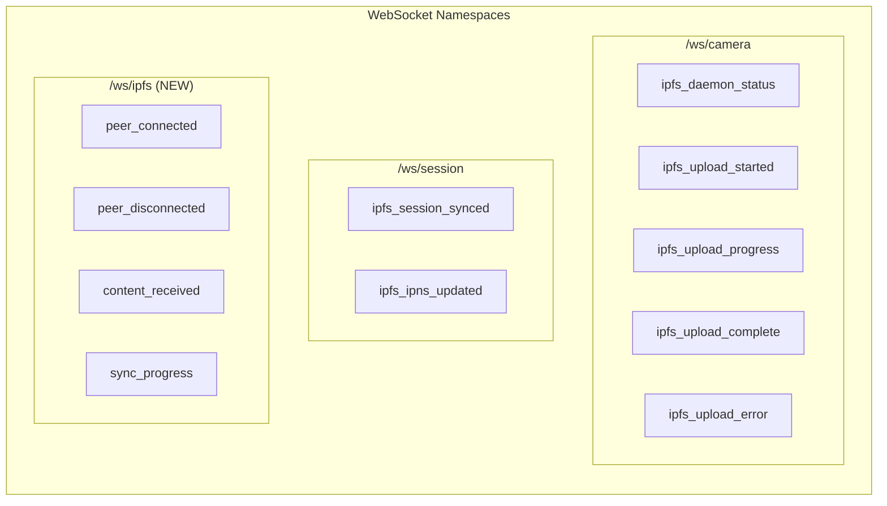

# WANDA IPFS API Design

## Overview

This document specifies the API changes required to integrate IPFS into WANDA. It covers REST endpoints, WebSocket events, and data models.

## API Architecture



---

## New REST Endpoints

### IPFS Status

#### `GET /api/ipfs/status`

Returns the current IPFS daemon status and node information.

**Response:**
```json
{
  "success": true,
  "data": {
    "daemon_running": true,
    "node_id": "12D3KooWBtg5rQ4WfGCq1ZqEBZvF9HCXM5vLcjqY4TXN3kPa9x2",
    "agent_version": "kubo/0.25.0/",
    "protocol_version": "ipfs/0.1.0",
    "addresses": [
      "/ip4/192.168.1.100/tcp/4001/p2p/12D3KooW...",
      "/ip4/127.0.0.1/tcp/4001/p2p/12D3KooW..."
    ],
    "public_key": "CAESIPu7J3aZ...",
    "ipns_name": "k51qzi5uqu5dg..."
  },
  "message": "IPFS daemon status retrieved"
}
```

**Error Response (daemon not running):**
```json
{
  "success": false,
  "error": {
    "code": "IPFS_DAEMON_OFFLINE",
    "message": "IPFS daemon is not running"
  }
}
```

---

#### `GET /api/ipfs/stats`

Returns storage and network statistics.

**Response:**
```json
{
  "success": true,
  "data": {
    "storage": {
      "repo_size_bytes": 1073741824,
      "repo_size_human": "1.0 GB",
      "storage_max_bytes": 10737418240,
      "storage_max_human": "10.0 GB",
      "num_objects": 1542,
      "usage_percent": 10.0
    },
    "network": {
      "peers_connected": 12,
      "bandwidth_in": "125.4 KB/s",
      "bandwidth_out": "42.1 KB/s",
      "total_in_bytes": 5242880000,
      "total_out_bytes": 1048576000
    },
    "pins": {
      "total": 156,
      "recursive": 45,
      "direct": 111
    },
    "wanda_network": {
      "known_nodes": 8,
      "connected_nodes": 3,
      "images_shared": 1245
    }
  },
  "message": "IPFS statistics retrieved"
}
```

---

### Pin Management

#### `GET /api/ipfs/pins`

List all pinned content.

**Query Parameters:**
| Parameter | Type | Default | Description |
|-----------|------|---------|-------------|
| `type` | string | `all` | Filter by pin type: `direct`, `recursive`, `indirect`, `all` |
| `limit` | int | `50` | Maximum results to return |
| `offset` | int | `0` | Pagination offset |

**Response:**
```json
{
  "success": true,
  "data": {
    "pins": [
      {
        "cid": "bafybeigdyrzt5sfp7udm7hu76uh7y26nf3efuylqabf3oclgtqy55fbzdi",
        "type": "recursive",
        "name": "Session: Moon 2025-01",
        "size_bytes": 52428800,
        "pinned_at": "2025-01-15T10:30:00Z",
        "local_path": "/captures/Moon 2025-01"
      },
      {
        "cid": "QmXnnyufdzAWL5CqZ2RnSNgPbvCc1ALT73s6epPrRnZ1Xy",
        "type": "direct",
        "name": "capture_0001.jpg",
        "size_bytes": 5242880,
        "pinned_at": "2025-01-15T09:00:00Z",
        "local_path": "/captures/capture_0001.jpg"
      }
    ],
    "total": 156,
    "limit": 50,
    "offset": 0
  },
  "message": "Pin list retrieved"
}
```

---

#### `POST /api/ipfs/pins`

Pin a CID locally.

**Request:**
```json
{
  "cid": "bafybeigdyrzt5sfp7udm7hu76uh7y26nf3efuylqabf3oclgtqy55fbzdi",
  "recursive": true,
  "name": "Interesting capture from Spain node"
}
```

**Response:**
```json
{
  "success": true,
  "data": {
    "cid": "bafybeigdyrzt5sfp7udm7hu76uh7y26nf3efuylqabf3oclgtqy55fbzdi",
    "status": "pinned",
    "size_bytes": 5242880
  },
  "message": "Content pinned successfully"
}
```

---

#### `DELETE /api/ipfs/pins/:cid`

Unpin content by CID.

**Response:**
```json
{
  "success": true,
  "data": {
    "cid": "bafybeigdyrzt5sfp7udm7hu76uh7y26nf3efuylqabf3oclgtqy55fbzdi",
    "status": "unpinned"
  },
  "message": "Content unpinned successfully"
}
```

---

### Content Operations

#### `GET /api/ipfs/content/:cid`

Retrieve content by CID. Supports both files and directories.

**Query Parameters:**
| Parameter | Type | Default | Description |
|-----------|------|---------|-------------|
| `format` | string | `auto` | Response format: `raw`, `json`, `redirect` |
| `download` | bool | `false` | Set Content-Disposition for download |

**Response (file - raw):**
```
Content-Type: image/jpeg
Content-Disposition: inline; filename="capture_0001.jpg"
X-IPFS-CID: bafybeigdyrzt5sfp7udm7hu76uh7y26nf3efuylqabf3oclgtqy55fbzdi

[binary image data]
```

**Response (directory - json):**
```json
{
  "success": true,
  "data": {
    "cid": "bafybeigdyrzt5sfp7udm7hu76uh7y26nf3efuylqabf3oclgtqy55fbzdi",
    "type": "directory",
    "entries": [
      {
        "name": "image_0001.jpg",
        "cid": "QmFile1...",
        "size": 5242880,
        "type": "file"
      },
      {
        "name": "image_0002.jpg",
        "cid": "QmFile2...",
        "size": 4718592,
        "type": "file"
      },
      {
        "name": "session_metadata.json",
        "cid": "QmMeta...",
        "size": 1024,
        "type": "file"
      }
    ]
  },
  "message": "Directory listing retrieved"
}
```

---

#### `POST /api/ipfs/content`

Add local content to IPFS.

**Request:**
```json
{
  "path": "/captures/capture_0001.jpg",
  "pin": true,
  "wrap_directory": false
}
```

**Response:**
```json
{
  "success": true,
  "data": {
    "cid": "bafybeigdyrzt5sfp7udm7hu76uh7y26nf3efuylqabf3oclgtqy55fbzdi",
    "size_bytes": 5242880,
    "pinned": true,
    "local_path": "/captures/capture_0001.jpg"
  },
  "message": "Content added to IPFS"
}
```

---

### Peer Management

#### `GET /api/ipfs/peers`

List connected IPFS peers and known WANDA nodes.

**Query Parameters:**
| Parameter | Type | Default | Description |
|-----------|------|---------|-------------|
| `wanda_only` | bool | `false` | Only show WANDA telescope nodes |

**Response:**
```json
{
  "success": true,
  "data": {
    "all_peers": 42,
    "wanda_nodes": [
      {
        "node_id": "12D3KooWSpain...",
        "name": "WANDA Spain",
        "location": "Madrid, Spain",
        "connected": true,
        "last_seen": "2025-01-15T10:30:00Z",
        "images_shared": 256,
        "ipns_name": "k51qzi5uqu..."
      },
      {
        "node_id": "12D3KooWJapan...",
        "name": "WANDA Japan",
        "location": "Tokyo, Japan",
        "connected": false,
        "last_seen": "2025-01-14T22:00:00Z",
        "images_shared": 512,
        "ipns_name": "k51qzi6abc..."
      }
    ]
  },
  "message": "Peer list retrieved"
}
```

---

#### `POST /api/ipfs/peers/connect`

Connect to a specific IPFS peer.

**Request:**
```json
{
  "multiaddr": "/ip4/1.2.3.4/tcp/4001/p2p/12D3KooWSpain..."
}
```

**Response:**
```json
{
  "success": true,
  "data": {
    "peer_id": "12D3KooWSpain...",
    "connected": true
  },
  "message": "Connected to peer"
}
```

---

## Modified Endpoints

### Captures List (Enhanced)

#### `GET /api/captures`

The existing captures endpoint is enhanced with IPFS metadata.

**Response:**
```json
{
  "success": true,
  "data": {
    "files": [
      {
        "name": "capture_0001.jpg",
        "path": "/captures/capture_0001.jpg",
        "size_bytes": 5242880,
        "captured_at": "2025-01-15T09:00:00Z",
        "ipfs": {
          "cid": "bafybeigdyrzt5sfp7udm7hu76uh7y26nf3efuylqabf3oclgtqy55fbzdi",
          "pinned": true,
          "synced": true,
          "replicas": 3
        }
      },
      {
        "name": "capture_0002.jpg",
        "path": "/captures/capture_0002.jpg",
        "size_bytes": 4718592,
        "captured_at": "2025-01-15T09:15:00Z",
        "ipfs": {
          "cid": null,
          "pinned": false,
          "synced": false,
          "replicas": 0,
          "status": "queued"
        }
      }
    ]
  },
  "message": "Capture list retrieved"
}
```

---

### Session Status (Enhanced)

#### `GET /api/session/status`

Enhanced with IPFS synchronization status.

**Response:**
```json
{
  "success": true,
  "data": {
    "status": "running",
    "name": "Moon 2025-01",
    "total_images": 50,
    "images_captured": 25,
    "start_time": "2025-01-15T08:00:00Z",
    "session_dir": "/captures/Moon 2025-01",
    "ipfs": {
      "enabled": true,
      "session_cid": null,
      "images_uploaded": 20,
      "images_pending": 5,
      "upload_progress_percent": 80,
      "ipns_name": "k51qzi5uqu...",
      "last_ipns_update": "2025-01-15T09:30:00Z"
    }
  },
  "message": "Session status retrieved"
}
```

---

### Capture Response (Enhanced)

#### `POST /api/capture`

Enhanced response includes IPFS information.

**Response:**
```json
{
  "success": true,
  "data": {
    "filename": "capture_0026.jpg",
    "path": "/captures/capture_0026.jpg",
    "size_bytes": 5242880,
    "captured_at": "2025-01-15T10:45:00Z",
    "ipfs": {
      "status": "queued",
      "queue_position": 1,
      "estimated_upload_time": "5s"
    }
  },
  "message": "Image captured successfully"
}
```

---

## WebSocket Events

### New IPFS Events



### Event Specifications

#### `/ws/camera` Namespace

**`ipfs_daemon_status`**
```json
{
  "event": "ipfs_daemon_status",
  "data": {
    "running": true,
    "peers_connected": 12,
    "storage_used_percent": 45
  }
}
```

**`ipfs_upload_started`**
```json
{
  "event": "ipfs_upload_started",
  "data": {
    "file": "capture_0026.jpg",
    "size_bytes": 5242880,
    "queue_position": 0
  }
}
```

**`ipfs_upload_progress`**
```json
{
  "event": "ipfs_upload_progress",
  "data": {
    "file": "capture_0026.jpg",
    "bytes_uploaded": 2621440,
    "total_bytes": 5242880,
    "percent": 50
  }
}
```

**`ipfs_upload_complete`**
```json
{
  "event": "ipfs_upload_complete",
  "data": {
    "file": "capture_0026.jpg",
    "cid": "bafybeigdyrzt5sfp7udm7hu76uh7y26nf3efuylqabf3oclgtqy55fbzdi",
    "size_bytes": 5242880,
    "upload_time_ms": 3500
  }
}
```

**`ipfs_upload_error`**
```json
{
  "event": "ipfs_upload_error",
  "data": {
    "file": "capture_0026.jpg",
    "error": "Connection to IPFS daemon failed",
    "will_retry": true,
    "retry_in_seconds": 30
  }
}
```

---

#### `/ws/session` Namespace

**`ipfs_session_synced`**
```json
{
  "event": "ipfs_session_synced",
  "data": {
    "session_name": "Moon 2025-01",
    "session_cid": "bafybeigdyrzt5sfp7udm7hu76uh7y26nf3efuylqabf3oclgtqy55fbzdi",
    "total_images": 50,
    "total_size_bytes": 262144000
  }
}
```

**`ipfs_ipns_updated`**
```json
{
  "event": "ipfs_ipns_updated",
  "data": {
    "ipns_name": "k51qzi5uqu5dkkciu33khkzbcmxtyhn2e4zdf7m5d",
    "resolves_to": "bafybeigdyrzt5sfp7udm7hu76uh7y26nf3efuylqabf3oclgtqy55fbzdi",
    "updated_at": "2025-01-15T10:30:00Z"
  }
}
```

---

#### `/ws/ipfs` Namespace (New)

**`peer_connected`**
```json
{
  "event": "peer_connected",
  "data": {
    "peer_id": "12D3KooWSpain...",
    "name": "WANDA Spain",
    "is_wanda_node": true
  }
}
```

**`peer_disconnected`**
```json
{
  "event": "peer_disconnected",
  "data": {
    "peer_id": "12D3KooWSpain...",
    "name": "WANDA Spain"
  }
}
```

**`content_received`**
```json
{
  "event": "content_received",
  "data": {
    "cid": "bafybeigdyrzt5sfp7udm7hu76uh7y26nf3efuylqabf3oclgtqy55fbzdi",
    "source_node": "WANDA Spain",
    "type": "image",
    "name": "capture_from_spain.jpg",
    "size_bytes": 5242880
  }
}
```

**`sync_progress`**
```json
{
  "event": "sync_progress",
  "data": {
    "source_node": "WANDA Spain",
    "images_synced": 45,
    "images_total": 100,
    "bytes_received": 236223488,
    "bytes_total": 524288000,
    "percent": 45
  }
}
```

---

## Data Models

### TypeScript Interfaces (Frontend)

```typescript
// lib/types/ipfs.ts

export interface IPFSStatus {
  daemon_running: boolean;
  node_id: string;
  agent_version: string;
  protocol_version: string;
  addresses: string[];
  public_key: string;
  ipns_name: string;
}

export interface IPFSStats {
  storage: {
    repo_size_bytes: number;
    repo_size_human: string;
    storage_max_bytes: number;
    storage_max_human: string;
    num_objects: number;
    usage_percent: number;
  };
  network: {
    peers_connected: number;
    bandwidth_in: string;
    bandwidth_out: string;
    total_in_bytes: number;
    total_out_bytes: number;
  };
  pins: {
    total: number;
    recursive: number;
    direct: number;
  };
  wanda_network: {
    known_nodes: number;
    connected_nodes: number;
    images_shared: number;
  };
}

export interface Pin {
  cid: string;
  type: 'direct' | 'recursive' | 'indirect';
  name?: string;
  size_bytes: number;
  pinned_at: string;
  local_path?: string;
}

export interface WANDANode {
  node_id: string;
  name: string;
  location: string;
  connected: boolean;
  last_seen: string;
  images_shared: number;
  ipns_name: string;
}

export interface CaptureIPFSMetadata {
  cid: string | null;
  pinned: boolean;
  synced: boolean;
  replicas: number;
  status?: 'queued' | 'uploading' | 'complete' | 'error';
}

export interface EnhancedCapture {
  name: string;
  path: string;
  size_bytes: number;
  captured_at: string;
  ipfs: CaptureIPFSMetadata;
}
```

### Python Models (Backend)

```python
# ipfs/models.py

from dataclasses import dataclass
from typing import Optional, List
from datetime import datetime
from enum import Enum

class PinType(Enum):
    DIRECT = "direct"
    RECURSIVE = "recursive"
    INDIRECT = "indirect"

@dataclass
class CID:
    hash: str
    version: int = 1
    
    def __str__(self) -> str:
        return self.hash
    
    @classmethod
    def from_string(cls, cid_string: str) -> 'CID':
        version = 0 if cid_string.startswith('Qm') else 1
        return cls(hash=cid_string, version=version)

@dataclass
class PeerInfo:
    peer_id: str
    addresses: List[str]
    agent_version: str
    protocol_version: str

@dataclass
class WANDANode:
    node_id: str
    name: str
    location: str
    ipns_name: str
    connected: bool = False
    last_seen: Optional[datetime] = None
    images_shared: int = 0

@dataclass
class Pin:
    cid: CID
    pin_type: PinType
    name: Optional[str] = None
    size_bytes: int = 0
    pinned_at: Optional[datetime] = None
    local_path: Optional[str] = None

@dataclass
class UploadStatus:
    file_path: str
    status: str  # 'queued', 'uploading', 'complete', 'error'
    cid: Optional[CID] = None
    progress_percent: int = 0
    error_message: Optional[str] = None
```

---

## Error Codes

| Code | HTTP Status | Description |
|------|-------------|-------------|
| `IPFS_DAEMON_OFFLINE` | 503 | IPFS daemon is not running |
| `IPFS_DAEMON_UNREACHABLE` | 503 | Cannot connect to IPFS daemon |
| `IPFS_TIMEOUT` | 504 | IPFS operation timed out |
| `IPFS_CID_NOT_FOUND` | 404 | CID not found locally or on network |
| `IPFS_PIN_FAILED` | 500 | Failed to pin content |
| `IPFS_UNPIN_FAILED` | 500 | Failed to unpin content |
| `IPFS_STORAGE_FULL` | 507 | IPFS repository storage limit reached |
| `IPFS_INVALID_CID` | 400 | Invalid CID format |
| `IPFS_PEER_UNREACHABLE` | 503 | Cannot connect to specified peer |

---

## Rate Limiting

| Endpoint | Rate Limit | Window |
|----------|------------|--------|
| `GET /api/ipfs/status` | 60 | 1 minute |
| `GET /api/ipfs/stats` | 30 | 1 minute |
| `POST /api/ipfs/pins` | 10 | 1 minute |
| `GET /api/ipfs/content/:cid` | 30 | 1 minute |
| `POST /api/ipfs/content` | 10 | 1 minute |

---

**Next**: See [storage-strategy.md](./storage-strategy.md) for data flow details.

