# WANDA IPFS Architecture

## Overview

This document describes the technical architecture for integrating IPFS into the WANDA telescope system. The design prioritizes backward compatibility, graceful degradation, and seamless user experience.

## Current Architecture

## Target Architecture with IPFS

## Component Architecture

### New Components

```mermaid
flowchart LR
    subgraph "New IPFS Components"
        subgraph "Python Backend"
            IPFSService["ipfs/service.py<br/>━━━━━━━━━━━━━━<br/>• add_file()<br/>• get_file()<br/>• pin_file()<br/>• unpin_file()<br/>• get_stats()"]
            
            IPFSClient["ipfs/client.py<br/>━━━━━━━━━━━━━━<br/>• HTTP API wrapper<br/>• Connection pooling<br/>• Retry logic"]
            
            IPFSConfig["ipfs/config.py<br/>━━━━━━━━━━━━━━<br/>• IPFS settings<br/>• Gateway URLs<br/>• Pin policies"]
            
            IPFSModels["ipfs/models.py<br/>━━━━━━━━━━━━━━<br/>• CID model<br/>• Pin status<br/>• Peer info"]
        end
        
        subgraph "Frontend"
            IPFSHook["hooks/useIPFS.ts<br/>━━━━━━━━━━━━━━<br/>• Upload status<br/>• Pin management<br/>• Network stats"]
            
            IPFSGallery["components/<br/>ipfs-gallery.tsx<br/>━━━━━━━━━━━━━━<br/>• Network images<br/>• Local + remote<br/>• CID display"]
        end
        
        IPFSService --> IPFSClient
        IPFSClient --> IPFSConfig
        IPFSService --> IPFSModels
    end
```

### Storage Router Flow

## Data Flow Architecture

### Image Capture Flow

### Image Retrieval Flow

## Network Architecture

### Multi-Node Topology

### Peer Discovery Flow

## Database Schema (Metadata)

## Configuration Architecture

```mermaid
flowchart LR
    subgraph "Configuration Hierarchy"
        subgraph "config.py (existing)"
            CameraConfig["Camera Settings"]
            MountConfig["Mount Settings"]
            StorageConfig["Storage Settings"]
        end
        
        subgraph "ipfs/config.py (new)"
            IPFSBasic["Basic Settings<br/>━━━━━━━━━━━━<br/>• daemon_addr<br/>• api_port<br/>• gateway_port"]
            
            IPFSAdvanced["Advanced Settings<br/>━━━━━━━━━━━━<br/>• swarm_addresses<br/>• bootstrap_nodes<br/>• announce_addresses"]
            
            IPFSPolicies["Storage Policies<br/>━━━━━━━━━━━━<br/>• auto_pin<br/>• pin_remote<br/>• gc_watermark<br/>• max_storage"]
            
            IPFSNetwork["Network Settings<br/>━━━━━━━━━━━━<br/>• pubsub_topic<br/>• dht_mode<br/>• relay_enabled"]
        end
        
        StorageConfig --> IPFSBasic
    end
```

## Error Handling Architecture

## Service Integration Points

## Deployment Architecture

## Summary

The IPFS integration adds three main architectural components:

1. **IPFS Service Layer** (`ipfs/`) - Python module handling all IPFS operations
2. **Storage Router** - Coordinates local and IPFS storage
3. **Kubo Daemon** - Local IPFS node (systemd service)

The design ensures:
- ✅ Local-first operation (works offline)
- ✅ Async IPFS publishing (no capture delays)
- ✅ Backward compatibility (existing code unchanged)
- ✅ Graceful degradation (falls back if IPFS unavailable)

---

**Next**: See [implementation-phases.md](./implementation-phases.md) for the phased rollout plan.

