# WANDA IPFS Implementation Phases

## Overview

This document outlines a phased approach to implementing IPFS in WANDA. Each phase builds upon the previous one, allowing for incremental testing and validation.

## Phase Overview

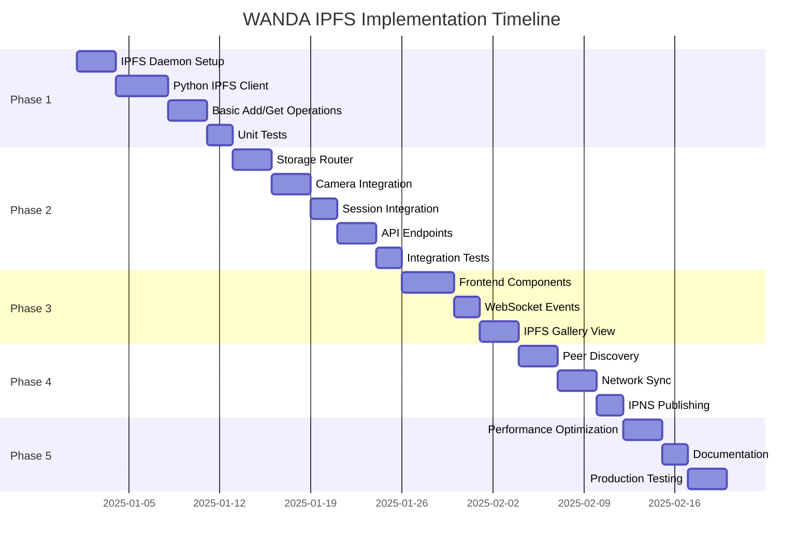

---

## Phase 1: Core IPFS Integration

**Duration:** 2 weeks  
**Goal:** Establish IPFS foundation with basic operations

### 1.1 IPFS Daemon Setup

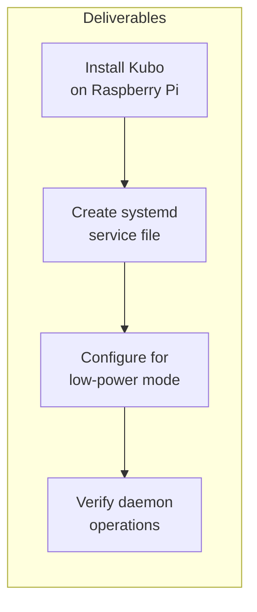

**Tasks:**
- [ ] Download and install Kubo v0.25+ for ARM64
- [ ] Create `wanda-ipfs.service` systemd unit file
- [ ] Configure IPFS with `lowpower` profile for Raspberry Pi
- [ ] Set up automatic startup on boot
- [ ] Configure firewall rules for IPFS ports (4001, 5001, 8080)

**Configuration Example:**
```bash
# Initialize with low-power profile
ipfs init --profile=lowpower

# Additional configuration
ipfs config --json Swarm.ConnMgr.LowWater 50
ipfs config --json Swarm.ConnMgr.HighWater 100
ipfs config --json Datastore.StorageMax '"10GB"'
```

### 1.2 Python IPFS Client Module

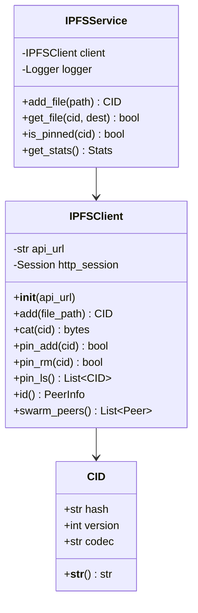

**Tasks:**
- [ ] Create `ipfs/` module directory
- [ ] Implement `ipfs/client.py` - HTTP API wrapper
- [ ] Implement `ipfs/service.py` - High-level service layer
- [ ] Implement `ipfs/models.py` - Data models (CID, PeerInfo)
- [ ] Implement `ipfs/config.py` - Configuration settings
- [ ] Add connection pooling and retry logic

### 1.3 Basic Add/Get Operations

**Tasks:**
- [ ] Implement file addition with automatic pinning
- [ ] Implement file retrieval by CID
- [ ] Add support for directory operations
- [ ] Implement local caching layer
- [ ] Add progress callbacks for large files

### 1.4 Unit Tests

**Tasks:**
- [ ] Create `tests/test_ipfs/` directory
- [ ] Write tests for IPFSClient (mock HTTP responses)
- [ ] Write tests for IPFSService
- [ ] Achieve 85%+ coverage for IPFS module
- [ ] Test error handling and retry logic

**Exit Criteria:**
- ✅ IPFS daemon runs as service and survives reboots
- ✅ Python can add/retrieve files via IPFS
- ✅ All unit tests pass with 85%+ coverage

---

## Phase 2: Storage Integration

**Duration:** 2 weeks  
**Goal:** Integrate IPFS with existing capture workflow

### 2.1 Storage Router

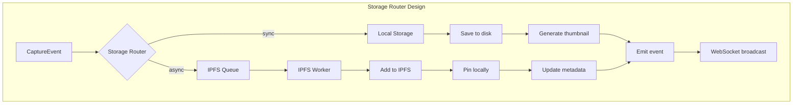

**Tasks:**
- [ ] Create `ipfs/router.py` - Storage routing logic
- [ ] Implement async IPFS upload queue
- [ ] Add metadata tracking (local path → CID mapping)
- [ ] Implement graceful fallback when IPFS unavailable
- [ ] Add queue persistence for crash recovery

### 2.2 Camera Integration

**Tasks:**
- [ ] Modify `AbstractCamera.capture_file()` to use StorageRouter
- [ ] Add CID to capture response
- [ ] Update `capture_status` to include IPFS status
- [ ] Ensure non-blocking IPFS operations

**Code Changes:**
```python
# camera/base.py (conceptual)
def capture_file(self, filename):
    # Existing capture logic...
    result = self._capture_to_file(filename)
    
    # New: Queue for IPFS
    if ipfs_enabled:
        storage_router.queue_for_ipfs(filename)
    
    return result
```

### 2.3 Session Integration

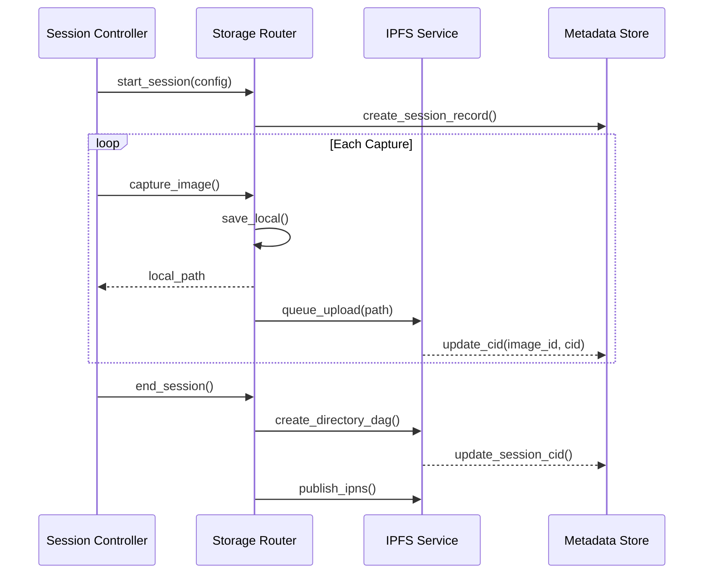

**Tasks:**
- [ ] Update `SessionController` to track CIDs per image
- [ ] Create session directory DAG on completion
- [ ] Add session CID to metadata export
- [ ] Implement session IPNS publishing

### 2.4 REST API Endpoints

**New Endpoints:**

| Method | Endpoint | Description |
|--------|----------|-------------|
| GET | `/api/ipfs/status` | IPFS daemon status |
| GET | `/api/ipfs/stats` | Storage and network stats |
| GET | `/api/captures/:id/cid` | Get CID for capture |
| GET | `/api/ipfs/:cid` | Retrieve file by CID |
| POST | `/api/ipfs/pin` | Pin a CID |
| DELETE | `/api/ipfs/pin/:cid` | Unpin a CID |
| GET | `/api/ipfs/peers` | List connected peers |

**Tasks:**
- [ ] Add IPFS routes to `web/app.py`
- [ ] Implement endpoint handlers
- [ ] Add error responses for IPFS failures
- [ ] Update API documentation

### 2.5 Integration Tests

**Tasks:**
- [ ] Test capture → IPFS flow end-to-end
- [ ] Test session → directory DAG creation
- [ ] Test API endpoints with real IPFS daemon
- [ ] Test fallback behavior when IPFS offline

**Exit Criteria:**
- ✅ Captures are automatically published to IPFS
- ✅ Session directories are created as IPFS DAGs
- ✅ API endpoints return IPFS information
- ✅ System works without IPFS (graceful degradation)

---

## Phase 3: Frontend Integration

**Duration:** 1.5 weeks  
**Goal:** Display IPFS information in UI

### 3.1 Frontend Components

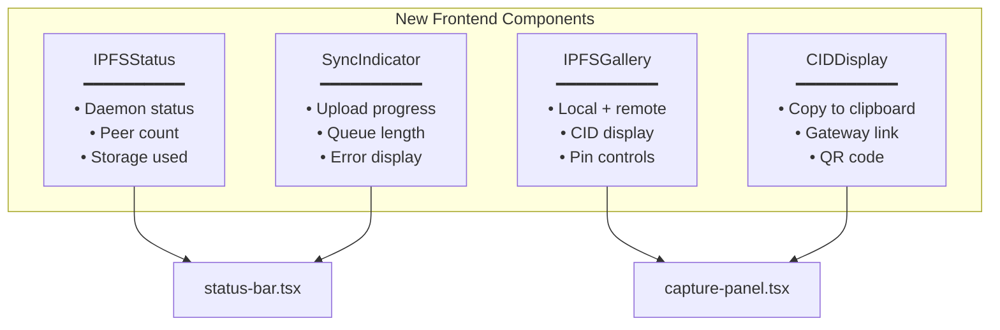

**Tasks:**
- [ ] Create `components/ipfs-status.tsx`
- [ ] Create `components/cid-display.tsx`
- [ ] Create `components/ipfs-gallery.tsx`
- [ ] Create `components/sync-indicator.tsx`
- [ ] Add TypeScript types for IPFS data

### 3.2 WebSocket Events

**New Events:**

| Event | Namespace | Payload |
|-------|-----------|---------|
| `ipfs_status` | `/ws/camera` | `{daemon: bool, peers: int}` |
| `ipfs_upload_start` | `/ws/camera` | `{file: string, size: int}` |
| `ipfs_upload_complete` | `/ws/camera` | `{file: string, cid: string}` |
| `ipfs_upload_error` | `/ws/camera` | `{file: string, error: string}` |
| `ipfs_peer_connected` | `/ws/session` | `{peer_id: string}` |

**Tasks:**
- [ ] Add IPFS events to Socket.IO namespaces
- [ ] Update `useWebSocket` hook for IPFS events
- [ ] Create `useIPFS` custom hook
- [ ] Test real-time updates

### 3.3 IPFS Gallery View

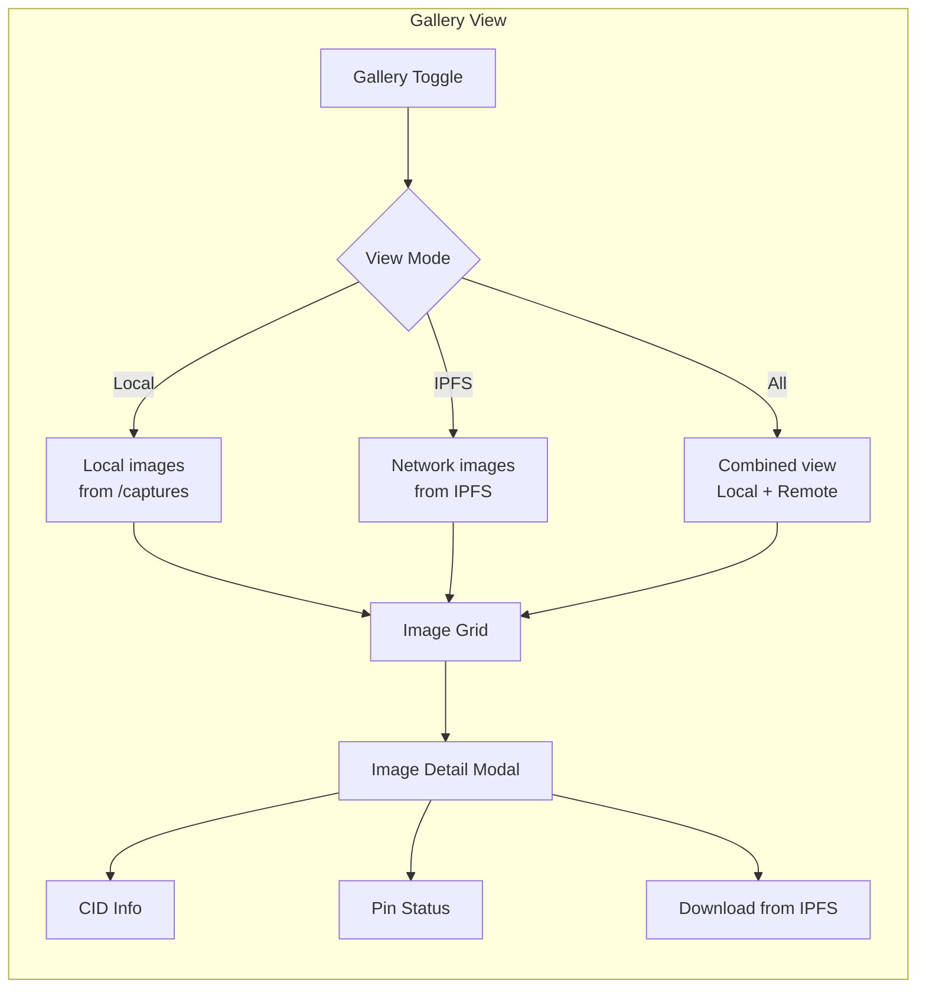

**Tasks:**
- [ ] Add view mode toggle to gallery
- [ ] Fetch and display remote IPFS images
- [ ] Show CID and pin status per image
- [ ] Add "Open in Gateway" button
- [ ] Implement lazy loading for IPFS images

**Exit Criteria:**
- ✅ IPFS status visible in UI
- ✅ CIDs displayed for uploaded images
- ✅ Real-time upload progress shown
- ✅ Users can browse network images

---

## Phase 4: Network Features

**Duration:** 1.5 weeks  
**Goal:** Enable WANDA node discovery and synchronization

### 4.1 Peer Discovery

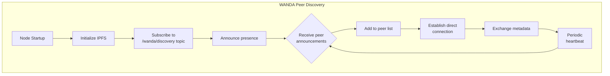

**Tasks:**
- [ ] Implement PubSub topic for WANDA nodes
- [ ] Create peer announcement protocol
- [ ] Build peer management service
- [ ] Add peer list to API and UI
- [ ] Implement peer scoring/reputation

### 4.2 Network Synchronization

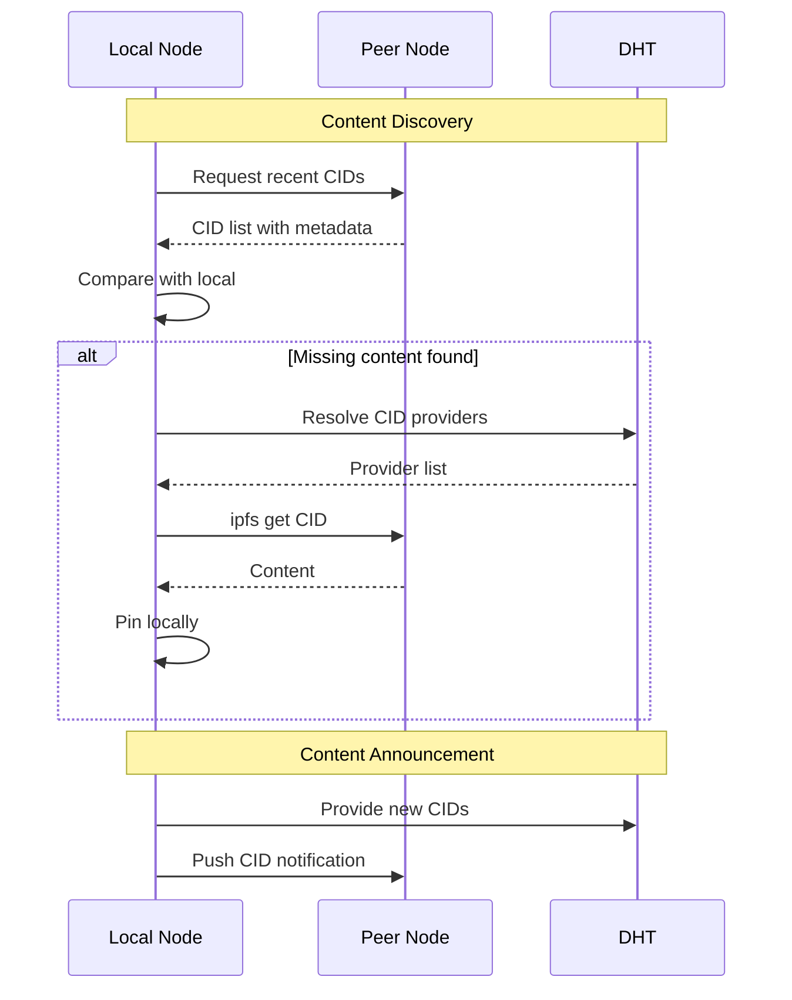

**Tasks:**
- [ ] Create sync protocol specification
- [ ] Implement CID exchange between peers
- [ ] Add selective sync (by session, date, etc.)
- [ ] Implement bandwidth throttling
- [ ] Add sync status to UI

### 4.3 IPNS Publishing

**Tasks:**
- [ ] Generate IPNS key per WANDA node
- [ ] Publish node's capture directory to IPNS
- [ ] Update IPNS on new captures
- [ ] Document IPNS name format
- [ ] Add IPNS resolution to gallery

**Exit Criteria:**
- ✅ WANDA nodes discover each other automatically
- ✅ Images sync between connected nodes
- ✅ Each node has an IPNS address for its captures

---

## Phase 5: Optimization & Production

**Duration:** 1 week  
**Goal:** Production-ready IPFS integration

### 5.1 Performance Optimization

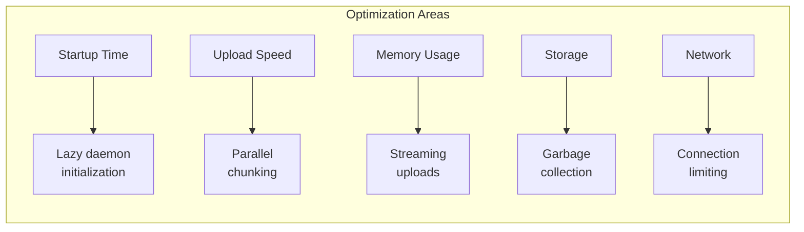

**Tasks:**
- [ ] Profile IPFS operations on Raspberry Pi
- [ ] Optimize memory usage for large files
- [ ] Implement garbage collection policy
- [ ] Add connection limiting for low-bandwidth
- [ ] Create performance benchmarks

### 5.2 Documentation

**Tasks:**
- [ ] Update main README with IPFS features
- [ ] Create IPFS troubleshooting guide
- [ ] Document configuration options
- [ ] Write peer discovery protocol spec
- [ ] Update deployment guide

### 5.3 Production Testing

**Tasks:**
- [ ] Multi-node testing (3+ nodes)
- [ ] Long-running stability tests
- [ ] Network partition testing
- [ ] Storage stress testing
- [ ] Performance benchmarks on Pi 4/5

**Exit Criteria:**
- ✅ System stable over 72+ hour test
- ✅ Memory usage under control
- ✅ Documentation complete
- ✅ Performance meets targets

---

## Risk Mitigation

### Technical Risks

| Risk | Mitigation |
|------|------------|
| IPFS daemon instability on Pi | Use `lowpower` profile, connection limiting |
| Network bandwidth constraints | Background sync, bandwidth throttling |
| Storage space exhaustion | Garbage collection, pin policies |
| Long upload times | Async operations, queue management |

### Rollback Strategy

Each phase has a rollback point:

1. **Phase 1**: Remove IPFS service, no impact on existing functionality
2. **Phase 2**: Disable storage router, revert to local-only
3. **Phase 3**: Hide IPFS UI components
4. **Phase 4**: Disable peer discovery, local-only IPFS
5. **Phase 5**: Revert optimizations if issues arise

## Dependency Chart

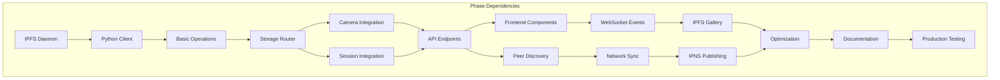

---

**Next**: See [ipfs-concepts.md](./ipfs-concepts.md) for IPFS fundamentals.

