# IPFS Concepts for WANDA

## Overview

This document explains the core IPFS concepts relevant to the WANDA telescope project. Understanding these fundamentals is essential for implementing and maintaining the distributed storage system.

## What is IPFS?

**IPFS (InterPlanetary File System)** is a peer-to-peer distributed file system that connects all computing devices with the same system of files.

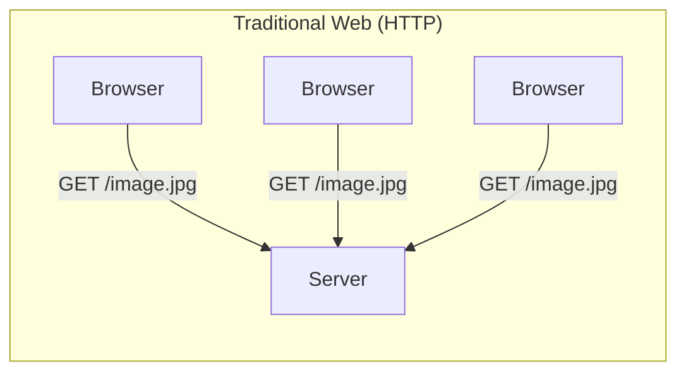

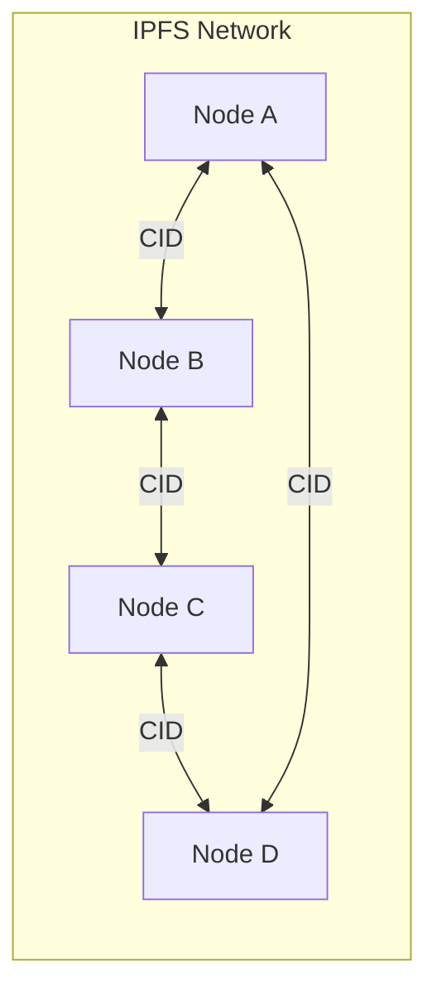

### Key Differences

| Feature | Traditional HTTP | IPFS |
|---------|-----------------|------|
| **Addressing** | Location-based (URL) | Content-based (CID) |
| **Server** | Single point of failure | Distributed network |
| **Caching** | Client-side only | Network-wide |
| **Integrity** | Trust the server | Cryptographically verified |
| **Censorship** | Easy to block | Resistant |

## Core Concepts

### 1. Content Addressing (CID)

Every file in IPFS is identified by its **Content Identifier (CID)** - a cryptographic hash of the content.

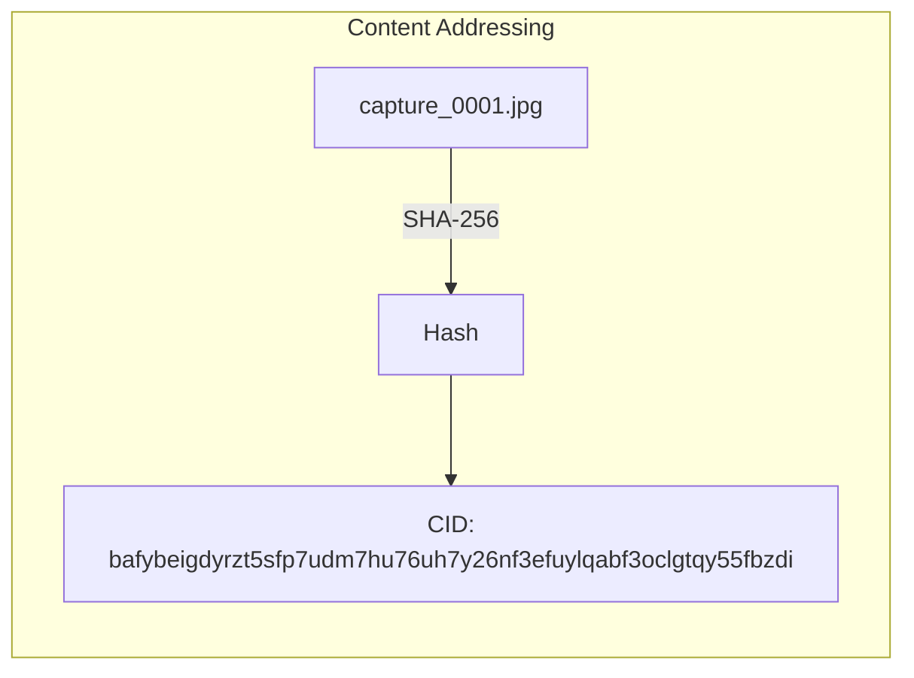

**Properties:**
- Same content → Same CID (always)
- Change 1 byte → Completely different CID
- CID can verify content integrity
- CID is globally unique

**Example:**
```bash
# Add a file to IPFS
$ ipfs add capture_0001.jpg
added QmXnnyufdzAWL5CqZ2RnSNgPbvCc1ALT73s6epPrRnZ1Xy capture_0001.jpg

# The CID is: QmXnnyufdzAWL5CqZ2RnSNgPbvCc1ALT73s6epPrRnZ1Xy
```

### CID Versions

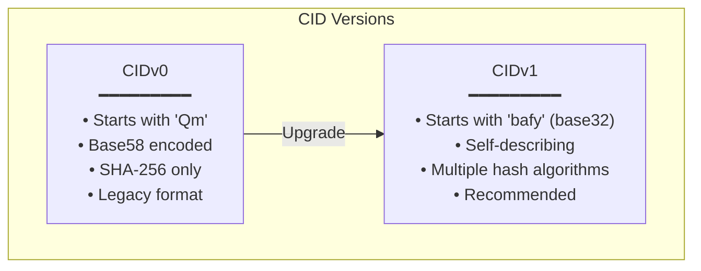

### 2. Merkle DAG (Directed Acyclic Graph)

IPFS stores files as a **Merkle DAG** - a tree where each node's ID is derived from its content.

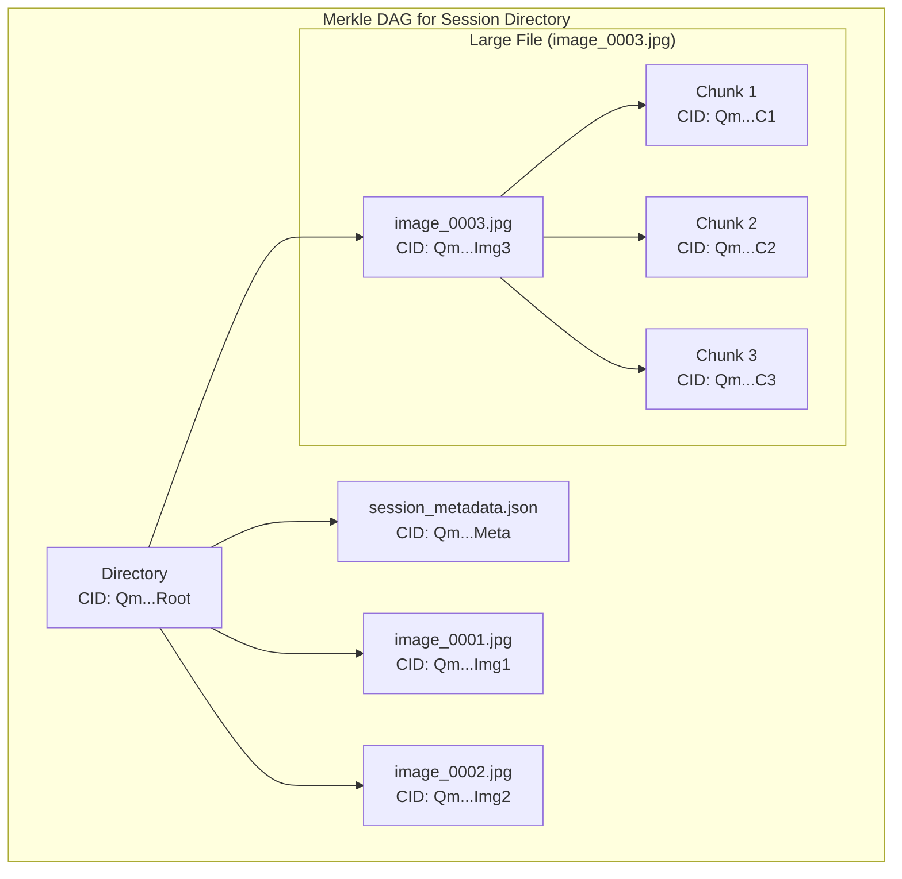

**Benefits for WANDA:**
- Session directories have a single CID representing all contents
- Changing one image changes only that image's CID and parent CIDs
- Large images are automatically chunked for efficient transfer
- Deduplication: identical images share the same CID

### 3. Pinning

By default, IPFS may garbage collect files. **Pinning** tells IPFS to keep specific content permanently.

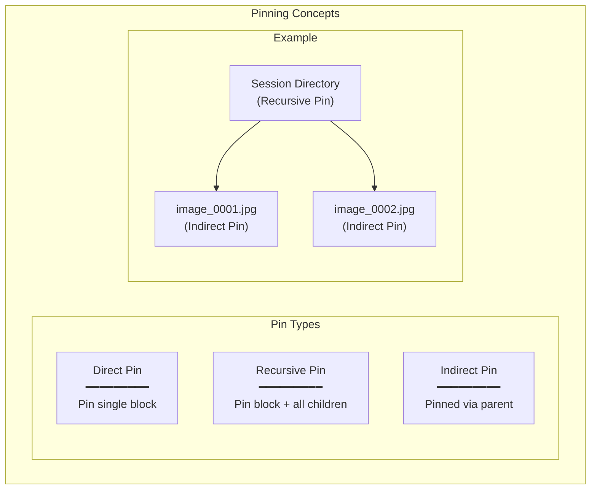

**WANDA Strategy:**
- Recursively pin session directories
- Pin individual captures directly
- Implement pin limits based on storage
- Auto-unpin old content when space needed

### 4. DHT (Distributed Hash Table)

The DHT is how IPFS nodes find content across the network.

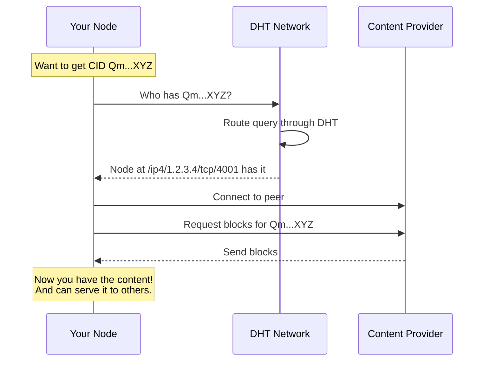

### 5. IPNS (InterPlanetary Name System)

IPNS provides **mutable references** to changing content.

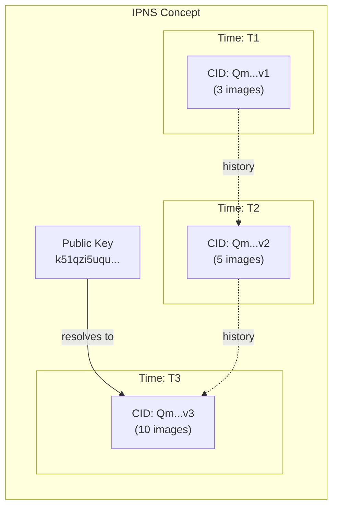

**WANDA Usage:**
- Each WANDA node has an IPNS key
- IPNS points to node's capture directory
- Update IPNS when new images captured
- Other nodes can subscribe to IPNS updates

**Example:**
```bash
# Generate IPNS key for WANDA node
$ ipfs key gen wanda-node

# Publish captures directory to IPNS
$ ipfs name publish --key=wanda-node QmSessionDirectory

# Anyone can resolve it
$ ipfs name resolve k51qzi5uqu5dkkciu33khkzbcmxtyhn2e4zdf7m5d
/ipfs/QmSessionDirectory
```

### 6. PubSub (Publish-Subscribe)

PubSub enables real-time messaging between IPFS nodes.

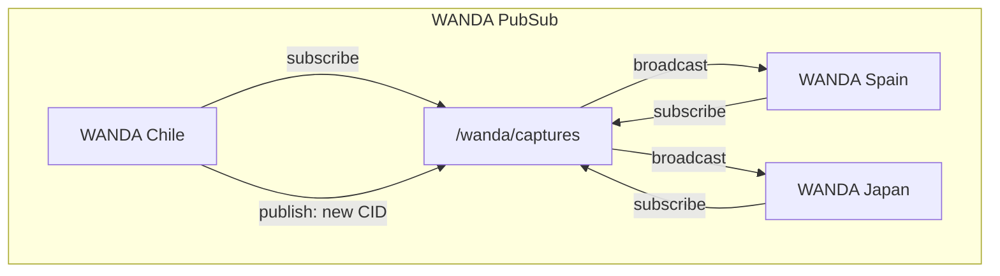

**WANDA Usage:**
- Topic for new capture announcements
- Topic for peer discovery
- Topic for session coordination

### 7. Gateways

IPFS gateways allow HTTP access to IPFS content.

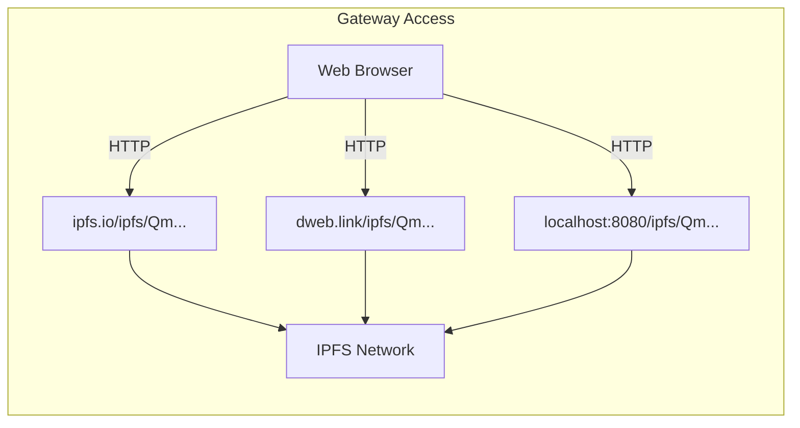

**Types:**
- **Public Gateways**: ipfs.io, dweb.link, cloudflare-ipfs.com
- **Local Gateway**: Kubo daemon at localhost:8080
- **Subdomain Gateway**: bafyxxx.ipfs.dweb.link

## IPFS in WANDA Context

### Data Model

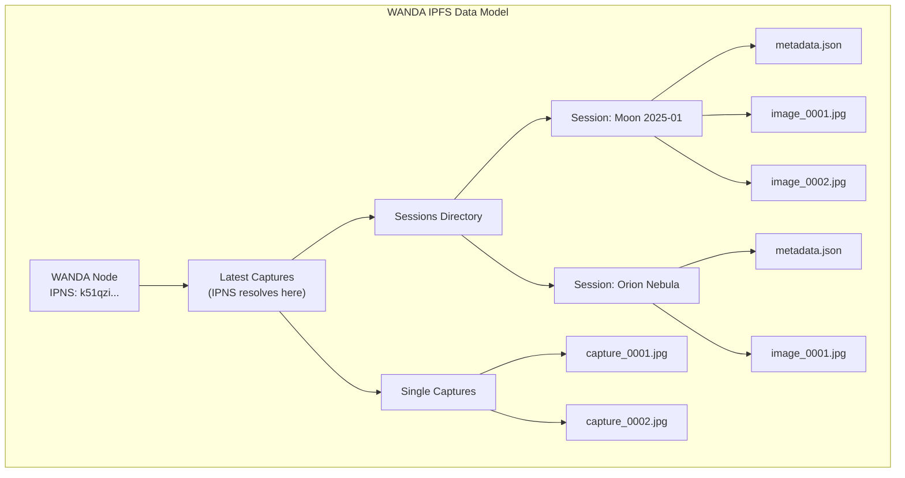

### Content Lifecycle

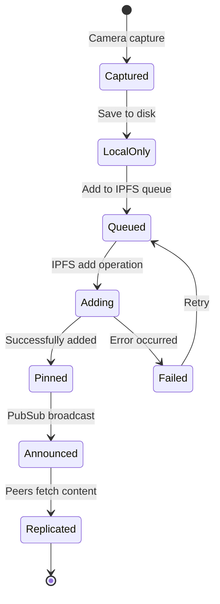

### Network Discovery

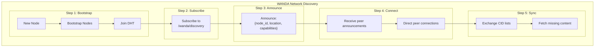

## Key Commands Reference

### Basic Operations

```bash
# Initialize IPFS
ipfs init --profile=lowpower

# Start daemon
ipfs daemon &

# Add file (returns CID)
ipfs add capture.jpg

# Add directory recursively
ipfs add -r session/

# Get file by CID
ipfs cat QmXnnyufdzAWL5CqZ2RnSNgPbvCc1ALT73s6epPrRnZ1Xy > image.jpg

# Get directory
ipfs get QmDirectoryCID -o ./output/
```

### Pinning

```bash
# Pin a CID (recursive by default)
ipfs pin add QmCID

# List pins
ipfs pin ls

# Unpin
ipfs pin rm QmCID

# Run garbage collection
ipfs repo gc
```

### Network

```bash
# Show node ID
ipfs id

# List connected peers
ipfs swarm peers

# Connect to specific peer
ipfs swarm connect /ip4/1.2.3.4/tcp/4001/p2p/QmPeerID

# Check DHT for providers
ipfs dht findprovs QmCID
```

### IPNS

```bash
# Create new key
ipfs key gen my-key

# Publish to IPNS
ipfs name publish --key=my-key QmCID

# Resolve IPNS
ipfs name resolve k51qzi5uqu...
```

### PubSub

```bash
# Subscribe to topic
ipfs pubsub sub /wanda/captures

# Publish to topic
echo "new capture: QmCID" | ipfs pubsub pub /wanda/captures

# List subscriptions
ipfs pubsub ls
```

## Performance Considerations

### On Raspberry Pi

| Concern | Mitigation |
|---------|------------|
| **Memory** | Use lowpower profile, limit connections |
| **CPU** | Avoid intensive operations during capture |
| **Storage** | Set storage limits, regular GC |
| **Bandwidth** | Throttle sync operations |

### Recommended Configuration

```json
{
  "Addresses": {
    "API": "/ip4/127.0.0.1/tcp/5001",
    "Gateway": "/ip4/127.0.0.1/tcp/8080",
    "Swarm": [
      "/ip4/0.0.0.0/tcp/4001",
      "/ip6/::/tcp/4001"
    ]
  },
  "Swarm": {
    "ConnMgr": {
      "LowWater": 50,
      "HighWater": 100,
      "GracePeriod": "20s"
    }
  },
  "Datastore": {
    "StorageMax": "10GB"
  },
  "Routing": {
    "Type": "dhtclient"
  }
}
```

## Glossary

| Term | Definition |
|------|------------|
| **CID** | Content Identifier - hash-based address for content |
| **DAG** | Directed Acyclic Graph - data structure for linking content |
| **DHT** | Distributed Hash Table - routing system for finding content |
| **IPNS** | Mutable naming system built on IPFS |
| **Kubo** | Go implementation of IPFS (formerly go-ipfs) |
| **libp2p** | Networking layer used by IPFS |
| **Merkle** | Tree structure where parent hashes include child hashes |
| **Pin** | Keep content from being garbage collected |
| **PubSub** | Publish-subscribe messaging system |
| **Swarm** | Peer-to-peer network connections |

---

**Next**: See [api-design.md](./api-design.md) for API specifications.

