# WANDA Network Topology

## Overview

This document describes the network architecture for the distributed WANDA telescope network, including peer discovery, communication protocols, and network resilience strategies.

## Network Vision

```mermaid
flowchart TB
    subgraph "Global WANDA Network"
        subgraph "South America"
            Chile["🔭 WANDA Chile<br/>Atacama Desert<br/>━━━━━━━━━━━━━<br/>Dark sky site<br/>Primary node"]
            Argentina["🔭 WANDA Argentina<br/>Patagonia"]
        end
        
        subgraph "Europe"
            Spain["🔭 WANDA Spain<br/>Canary Islands<br/>━━━━━━━━━━━━━<br/>Observatory partner"]
            Germany["🔭 WANDA Germany<br/>Black Forest"]
            UK["🔭 WANDA UK<br/>Wales"]
        end
        
        subgraph "Asia Pacific"
            Japan["🔭 WANDA Japan<br/>Hokkaido"]
            Australia["🔭 WANDA Australia<br/>Outback<br/>━━━━━━━━━━━━━<br/>Southern sky"]
            NZ["🔭 WANDA New Zealand<br/>South Island"]
        end
        
        subgraph "North America"
            USA["🔭 WANDA USA<br/>Arizona"]
            Canada["🔭 WANDA Canada<br/>Alberta"]
        end
        
        Chile <--> Argentina
        Chile <-.-> Spain
        Spain <--> Germany
        Germany <--> UK
        Japan <--> Australia
        Australia <--> NZ
        USA <--> Canada
        Spain <-.-> USA
        Australia <-.-> Chile
    end
```



## Network Layers

```mermaid
flowchart TB
    subgraph "WANDA Network Stack"
        L4["Layer 4: Application<br/>━━━━━━━━━━━━━<br/>WANDA Protocol<br/>Image sharing, Session sync"]
        
        L3["Layer 3: Content<br/>━━━━━━━━━━━━━<br/>IPFS/IPNS<br/>Content addressing, DHT"]
        
        L2["Layer 2: Transport<br/>━━━━━━━━━━━━━<br/>libp2p<br/>Peer connections, Multiplexing"]
        
        L1["Layer 1: Network<br/>━━━━━━━━━━━━━<br/>TCP/UDP/QUIC<br/>Internet connectivity"]
    end
    
    L4 --> L3
    L3 --> L2
    L2 --> L1
```



## Peer Discovery

### Discovery Mechanisms

```mermaid
flowchart LR
    subgraph "Discovery Methods"
        A["Bootstrap Nodes<br/>━━━━━━━━━━━━━<br/>Initial connection<br/>Known IPFS nodes"]
        
        B["DHT Discovery<br/>━━━━━━━━━━━━━<br/>Find peers by topic<br/>Decentralized"]
        
        C["mDNS (Local)<br/>━━━━━━━━━━━━━<br/>Same LAN discovery<br/>Zero config"]
        
        D["PubSub Rendezvous<br/>━━━━━━━━━━━━━<br/>WANDA topic<br/>Real-time updates"]
        
        E["Manual Peering<br/>━━━━━━━━━━━━━<br/>Configured peers<br/>Trusted connections"]
    end
```



### Discovery Flow


### Announcement Protocol

```json
// WANDA Discovery Announcement Message
{
  "protocol": "wanda/discovery/1.0",
  "type": "announce",
  "node": {
    "id": "12D3KooWSpain...",
    "name": "WANDA Spain",
    "version": "1.5.0",
    "location": {
      "name": "Canary Islands, Spain",
      "latitude": 28.2916,
      "longitude": -16.6291,
      "timezone": "Atlantic/Canary"
    },
    "capabilities": [
      "imaging",
      "tracking",
      "sessions"
    ],
    "camera": {
      "model": "IMX477",
      "resolution": "4056x3040"
    },
    "ipns_name": "k51qzi5uqu...",
    "captures_count": 1542,
    "uptime_hours": 720
  },
  "addresses": [
    "/ip4/1.2.3.4/tcp/4001/p2p/12D3KooWSpain...",
    "/ip4/1.2.3.4/udp/4001/quic-v1/p2p/12D3KooWSpain..."
  ],
  "timestamp": "2025-01-15T10:30:00Z",
  "signature": "..."
}
```

## Communication Protocols

### PubSub Topics

```mermaid
flowchart TB
    subgraph "WANDA PubSub Topics"
        T1["/wanda/discovery<br/>━━━━━━━━━━━━━<br/>Node announcements<br/>Heartbeats"]
        
        T2["/wanda/captures<br/>━━━━━━━━━━━━━<br/>New capture announcements<br/>CID broadcasts"]
        
        T3["/wanda/sessions<br/>━━━━━━━━━━━━━<br/>Session start/complete<br/>Collaboration requests"]
        
        T4["/wanda/events<br/>━━━━━━━━━━━━━<br/>Celestial events<br/>Coordinated observations"]
        
        T5["/wanda/chat<br/>━━━━━━━━━━━━━<br/>Operator messages<br/>Coordination"]
    end
```



### Message Types

| Topic | Message Type | Purpose |
|-------|--------------|---------|
| `/wanda/discovery` | `announce` | New node online |
| `/wanda/discovery` | `heartbeat` | Periodic presence |
| `/wanda/discovery` | `goodbye` | Graceful disconnect |
| `/wanda/captures` | `new_capture` | Single image available |
| `/wanda/captures` | `session_complete` | Full session ready |
| `/wanda/sessions` | `session_start` | Beginning observation |
| `/wanda/sessions` | `collab_request` | Request synchronized capture |
| `/wanda/events` | `event_alert` | Celestial event notification |
| `/wanda/events` | `join_observation` | Join coordinated session |

### Protocol Messages


## Topology Patterns

### Mesh Network


### Regional Clusters


### Hub and Spoke (Optional)


## Network Resilience

### Failure Handling


### Connection Management


### Retry Configuration

```python
# ipfs/config.py

CONNECTION_CONFIG = {
    "initial_backoff_ms": 1000,
    "max_backoff_ms": 60000,
    "backoff_multiplier": 2,
    "max_retries": 10,
    "heartbeat_interval_s": 30,
    "heartbeat_timeout_s": 90,
    "connection_timeout_s": 30
}

RESILIENCE_CONFIG = {
    "min_peers": 3,
    "target_peers": 10,
    "max_peers": 50,
    "peer_exchange_interval_s": 300,
    "bootstrap_retry_interval_s": 600
}
```

## NAT Traversal

### Strategies


### libp2p Configuration

```json
{
  "Swarm": {
    "Transports": {
      "Network": {
        "QUIC": true,
        "TCP": true,
        "Websocket": true
      }
    },
    "RelayClient": {
      "Enabled": true
    },
    "RelayService": {
      "Enabled": true
    },
    "EnableHolePunching": true
  },
  "AutoNAT": {
    "ServiceMode": "enabled"
  }
}
```

## Bandwidth Management

### Traffic Shaping


### Quality of Service

```python
# ipfs/config.py

BANDWIDTH_CONFIG = {
    "total_limit_mbps": 50,
    
    "upload": {
        "limit_mbps": 20,
        "priorities": {
            "local_captures": 0.50,  # 10 Mbps
            "sync": 0.40,            # 8 Mbps
            "discovery": 0.10        # 2 Mbps
        }
    },
    
    "download": {
        "limit_mbps": 30,
        "priorities": {
            "on_demand": 0.50,       # 15 Mbps
            "background_sync": 0.40, # 12 Mbps
            "prefetch": 0.10         # 3 Mbps
        }
    },
    
    "schedule": {
        "peak_hours": "18:00-23:00",
        "peak_limit_percent": 50,
        "offpeak_unlimited": True
    }
}
```

## Security Considerations

### Peer Authentication


### Trust Levels

| Level | Description | Permissions |
|-------|-------------|-------------|
| **Unknown** | Any IPFS peer | Read public CIDs |
| **WANDA Node** | Verified WANDA installation | Sync content, PubSub |
| **Trusted** | Manually approved | Priority sync, Collaboration |
| **Local** | Same operator | Full access |

## Monitoring

### Network Metrics


### Prometheus Metrics

```python
# Example metrics for monitoring

NETWORK_METRICS = {
    "wanda_peers_connected": Gauge,
    "wanda_peers_known": Gauge,
    "wanda_bandwidth_in_bytes": Counter,
    "wanda_bandwidth_out_bytes": Counter,
    "wanda_peer_latency_ms": Histogram,
    "wanda_discovery_time_seconds": Histogram,
    "wanda_sync_queue_length": Gauge,
    "wanda_connection_errors_total": Counter
}
```

## Regional Considerations

### Latency Optimization


### Time Zone Coordination

For coordinated observations across time zones:

```json
{
  "observation_event": {
    "name": "Lunar Eclipse 2025",
    "utc_start": "2025-03-14T00:00:00Z",
    "utc_end": "2025-03-14T06:00:00Z",
    "participating_nodes": [
      {
        "node": "WANDA Chile",
        "local_time": "21:00-03:00",
        "visibility": "full"
      },
      {
        "node": "WANDA Spain",
        "local_time": "01:00-07:00",
        "visibility": "partial"
      },
      {
        "node": "WANDA Japan",
        "local_time": "09:00-15:00",
        "visibility": "none"
      }
    ]
  }
}
```

---

**Next**: See [security-considerations.md](./security-considerations.md) for security analysis.

