# WANDA IPFS Security Considerations

## Overview

This document analyzes security considerations for the WANDA IPFS integration, covering data privacy, node authentication, network security, and threat mitigation.

## Threat Model

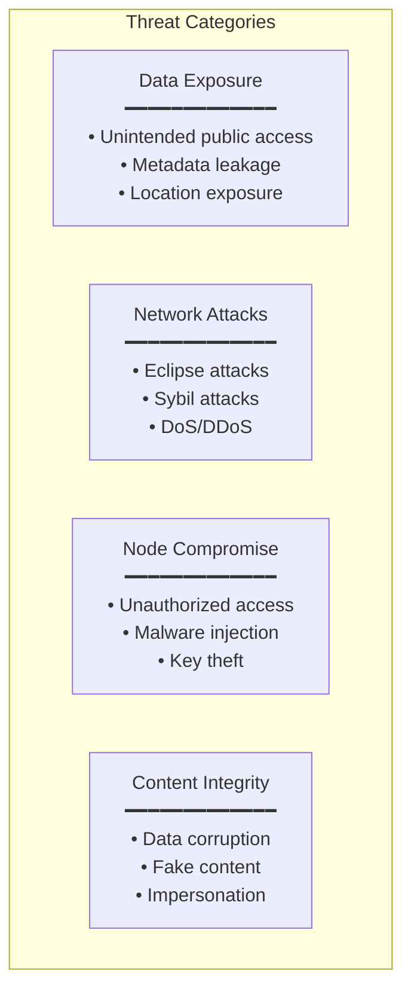

## Data Privacy

### Content Visibility

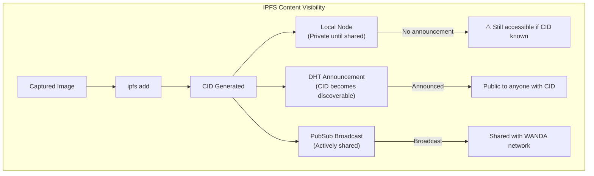

### Privacy Levels

| Level | Description | Implementation |
|-------|-------------|----------------|
| **Private** | Node only, no DHT | `ipfs add --offline` |
| **WANDA Network** | Shared with verified nodes | Encrypted + WANDA PubSub |
| **Public** | Available to anyone | Standard IPFS add |

### Sensitive Data Protection

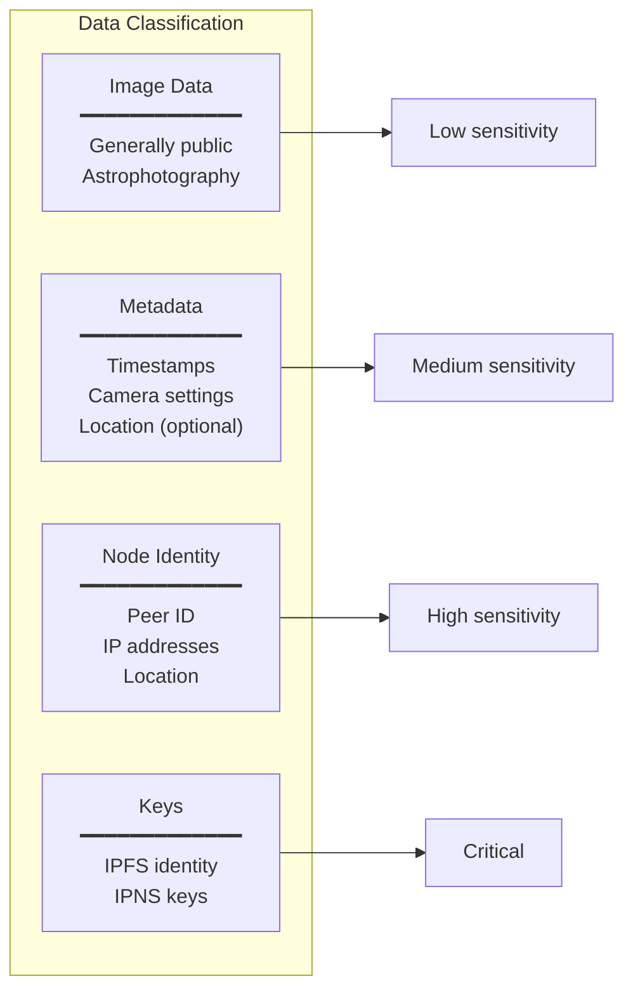

### Location Privacy

**Risks:**
- IPFS peers can see connecting IP addresses
- Metadata may contain GPS coordinates
- Node names may reveal location

**Mitigations:**

```python
# ipfs/config.py

PRIVACY_CONFIG = {
    # Strip GPS data from images before IPFS
    "strip_exif_gps": True,
    
    # Anonymize node location in announcements
    "location_precision": "country",  # "city", "country", "none"
    
    # Use relay for privacy
    "force_relay_connections": False,
    
    # Metadata sanitization
    "sanitize_metadata": {
        "remove_gps": True,
        "remove_timestamps": False,
        "remove_camera_serial": True
    }
}
```

## Authentication & Authorization

### Node Identity

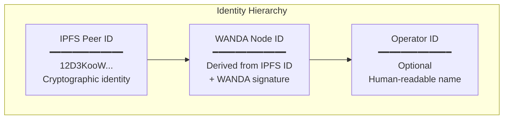

### Trust Establishment

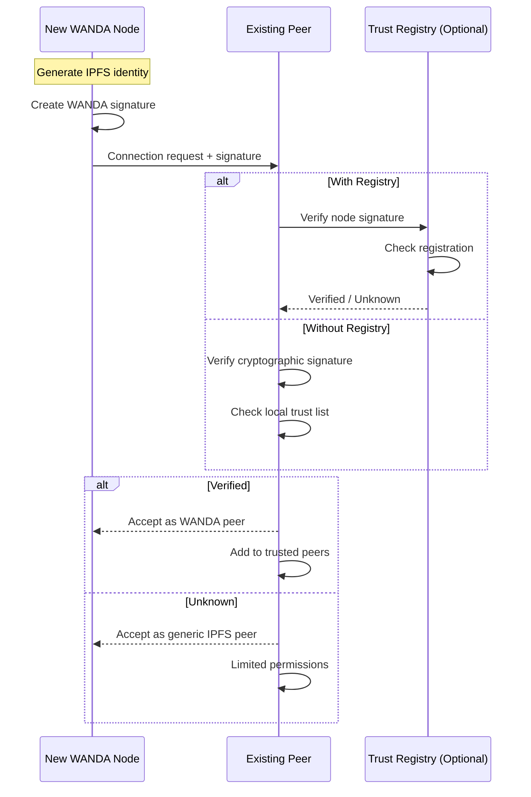

### Authorization Matrix

| Action | Unknown Peer | WANDA Node | Trusted Node | Local |
|--------|--------------|------------|--------------|-------|
| Fetch public CIDs | ✅ | ✅ | ✅ | ✅ |
| Receive announcements | ❌ | ✅ | ✅ | ✅ |
| Sync captures | ❌ | ✅ | ✅ | ✅ |
| Join sessions | ❌ | ❌ | ✅ | ✅ |
| Modify settings | ❌ | ❌ | ❌ | ✅ |

## Network Security

### Attack Vectors

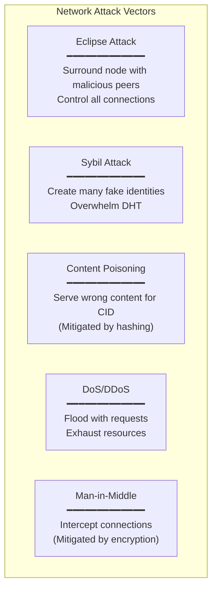

### Mitigations

#### Eclipse Attack Prevention

```python
# ipfs/config.py

SECURITY_CONFIG = {
    # Maintain connections to trusted bootstrap nodes
    "min_bootstrap_connections": 2,
    
    # Require peer diversity
    "peer_diversity": {
        "enabled": True,
        "min_unique_asns": 3,
        "max_peers_per_asn": 10
    },
    
    # Static trusted peers
    "static_peers": [
        "/ip4/1.2.3.4/tcp/4001/p2p/12D3KooWTrusted1...",
        "/ip4/5.6.7.8/tcp/4001/p2p/12D3KooWTrusted2..."
    ]
}
```

#### Sybil Attack Prevention

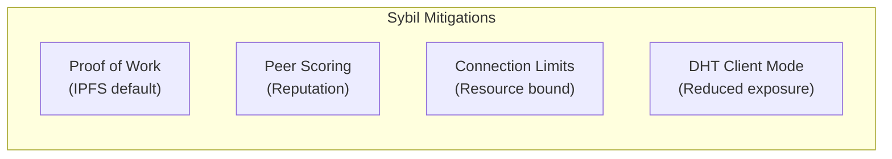

#### DoS Prevention

```python
# ipfs/config.py

RATE_LIMITING = {
    # Connection rate limiting
    "max_new_connections_per_minute": 20,
    
    # Request rate limiting
    "max_requests_per_minute": 100,
    
    # Bandwidth limiting
    "max_bandwidth_mbps": 50,
    
    # Resource limits
    "max_concurrent_requests": 10,
    "request_timeout_seconds": 30
}
```

### Firewall Configuration

```bash
# Recommended iptables rules for WANDA IPFS

# Allow IPFS swarm (P2P connections)
iptables -A INPUT -p tcp --dport 4001 -j ACCEPT
iptables -A INPUT -p udp --dport 4001 -j ACCEPT

# Allow IPFS API (localhost only)
iptables -A INPUT -p tcp --dport 5001 -s 127.0.0.1 -j ACCEPT
iptables -A INPUT -p tcp --dport 5001 -j DROP

# Allow IPFS gateway (localhost only or restrict to LAN)
iptables -A INPUT -p tcp --dport 8080 -s 127.0.0.1 -j ACCEPT
iptables -A INPUT -p tcp --dport 8080 -s 192.168.0.0/16 -j ACCEPT
iptables -A INPUT -p tcp --dport 8080 -j DROP

# Rate limit new connections
iptables -A INPUT -p tcp --dport 4001 -m state --state NEW -m limit --limit 10/min -j ACCEPT
```

## Content Integrity

### Verification Chain

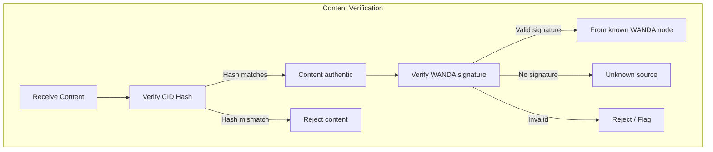

### Image Signing

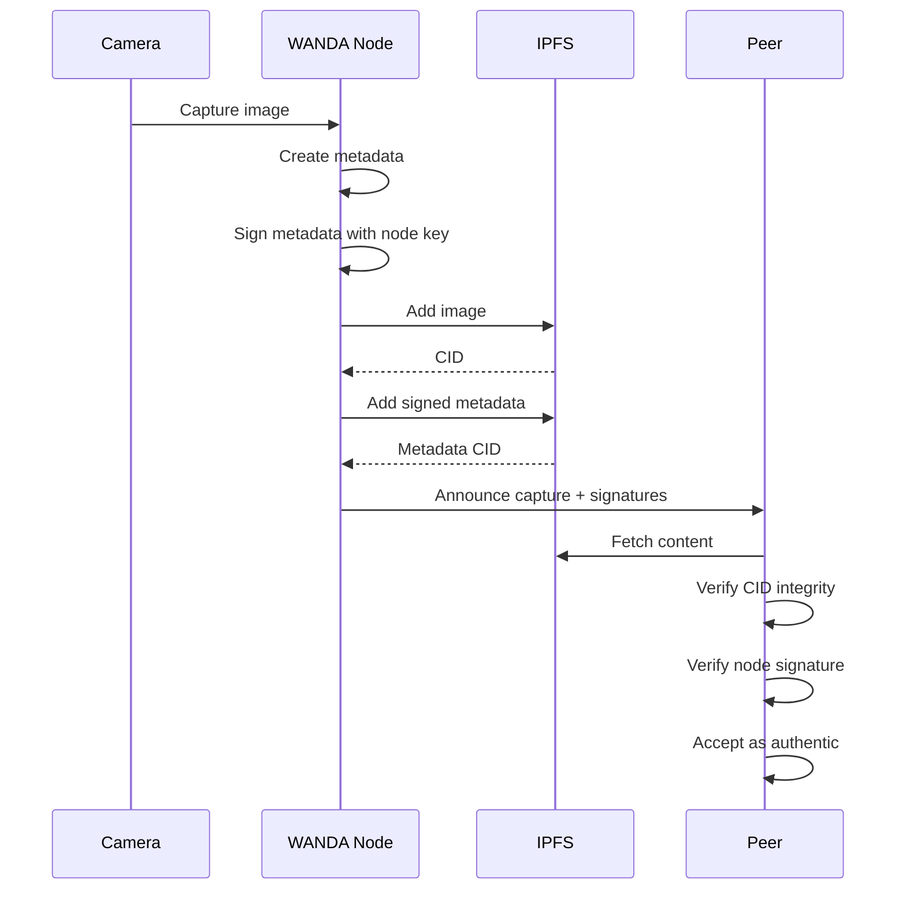

### Metadata Signing

```python
# ipfs/security.py

from cryptography.hazmat.primitives import hashes, serialization
from cryptography.hazmat.primitives.asymmetric import ed25519
import json

class ContentSigner:
    def __init__(self, private_key_path: str):
        with open(private_key_path, 'rb') as f:
            self.private_key = ed25519.Ed25519PrivateKey.from_private_bytes(
                f.read()
            )
        self.public_key = self.private_key.public_key()
    
    def sign_capture_metadata(self, metadata: dict) -> dict:
        """Sign capture metadata for verification by peers."""
        # Canonical JSON encoding
        data = json.dumps(metadata, sort_keys=True).encode()
        
        # Sign with node's private key
        signature = self.private_key.sign(data)
        
        return {
            **metadata,
            "signature": signature.hex(),
            "signer_public_key": self.public_key.public_bytes(
                encoding=serialization.Encoding.Raw,
                format=serialization.PublicFormat.Raw
            ).hex()
        }
    
    def verify_signature(self, metadata: dict) -> bool:
        """Verify a signed metadata object."""
        signature = bytes.fromhex(metadata.pop("signature"))
        public_key_bytes = bytes.fromhex(metadata.pop("signer_public_key"))
        
        public_key = ed25519.Ed25519PublicKey.from_public_bytes(
            public_key_bytes
        )
        
        data = json.dumps(metadata, sort_keys=True).encode()
        
        try:
            public_key.verify(signature, data)
            return True
        except Exception:
            return False
```

## Key Management

### Key Types

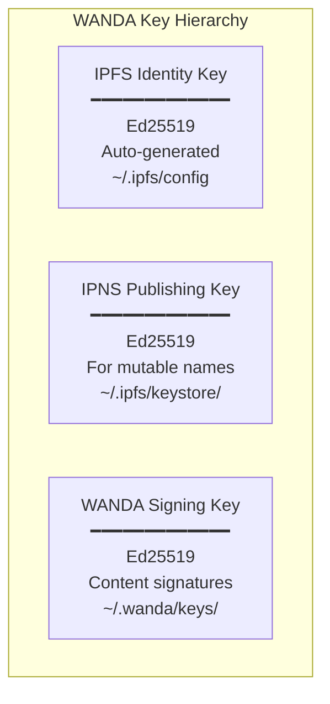

### Key Storage

```python
# Secure key storage recommendations

KEY_STORAGE = {
    # IPFS keys (managed by Kubo)
    "ipfs_identity": "~/.ipfs/config",  # Auto-managed
    "ipns_keys": "~/.ipfs/keystore/",   # Auto-managed
    
    # WANDA keys
    "wanda_signing": {
        "path": "~/.wanda/keys/signing.key",
        "permissions": 0o600,
        "backup": "encrypted_backup.key.enc"
    },
    
    # Key backup
    "backup_encryption": "AES-256-GCM",
    "backup_location": "offline_storage"
}
```

### Key Rotation

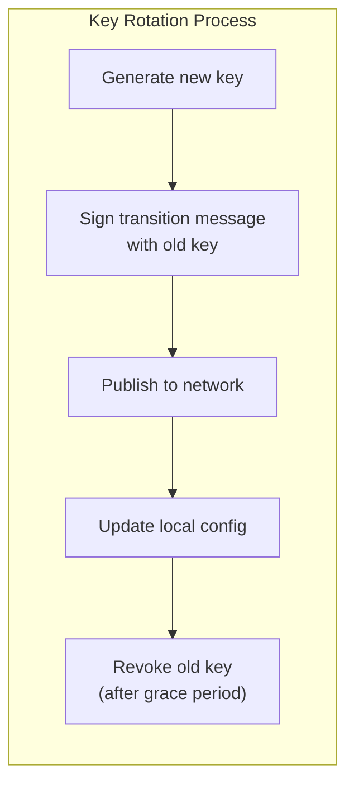

## Incident Response

### Security Events

| Event | Severity | Response |
|-------|----------|----------|
| Unauthorized access attempt | Medium | Log, rate limit, alert |
| Invalid signature detected | Medium | Reject, log, flag peer |
| Key compromise suspected | Critical | Rotate keys, alert network |
| DoS attack detected | High | Rate limit, block IPs |
| Malicious content found | High | Unpin, report, blacklist source |

### Monitoring

```python
# ipfs/security.py

SECURITY_MONITORING = {
    "log_events": [
        "connection_rejected",
        "signature_invalid",
        "rate_limit_exceeded",
        "suspicious_peer",
        "unauthorized_request"
    ],
    
    "alert_thresholds": {
        "failed_connections_per_hour": 100,
        "invalid_signatures_per_hour": 10,
        "rate_limit_hits_per_hour": 50
    },
    
    "alert_methods": ["log", "websocket", "email"],
    
    "audit_log_path": "/var/log/wanda/security.log"
}
```

### Response Playbooks

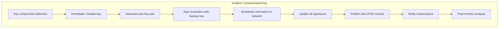

## Best Practices Checklist

### Node Setup

- [ ] Run IPFS API on localhost only (127.0.0.1:5001)
- [ ] Configure firewall rules
- [ ] Enable connection limiting
- [ ] Use DHT client mode (reduced attack surface)
- [ ] Set up log monitoring

### Data Handling

- [ ] Strip sensitive EXIF data before upload
- [ ] Sign all metadata with node key
- [ ] Verify signatures on received content
- [ ] Implement content moderation for shared network

### Key Security

- [ ] Secure key file permissions (600)
- [ ] Back up keys securely (encrypted, offline)
- [ ] Document key rotation procedure
- [ ] Have incident response plan ready

### Network Security

- [ ] Maintain diverse peer connections
- [ ] Configure rate limiting
- [ ] Monitor for suspicious activity
- [ ] Keep Kubo/IPFS updated

## Compliance Considerations

### Data Sovereignty

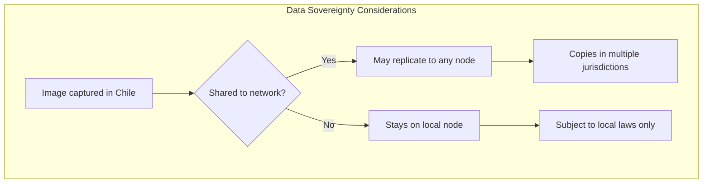

### GDPR Considerations

If operating in EU or handling EU user data:

- **Right to erasure**: Unpinning removes local copy, but cannot force network erasure
- **Data minimization**: Don't collect unnecessary metadata
- **Consent**: Ensure operators consent to distributed storage

### Recommendations

1. **Default to local-only** for sensitive content
2. **Document data flows** for compliance
3. **Provide opt-out** for network sharing
4. **Implement data retention policies**

---

**Next**: See [testing-strategy.md](./testing-strategy.md) for testing approach.

