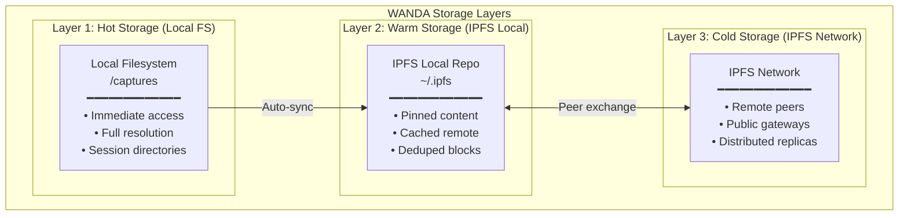
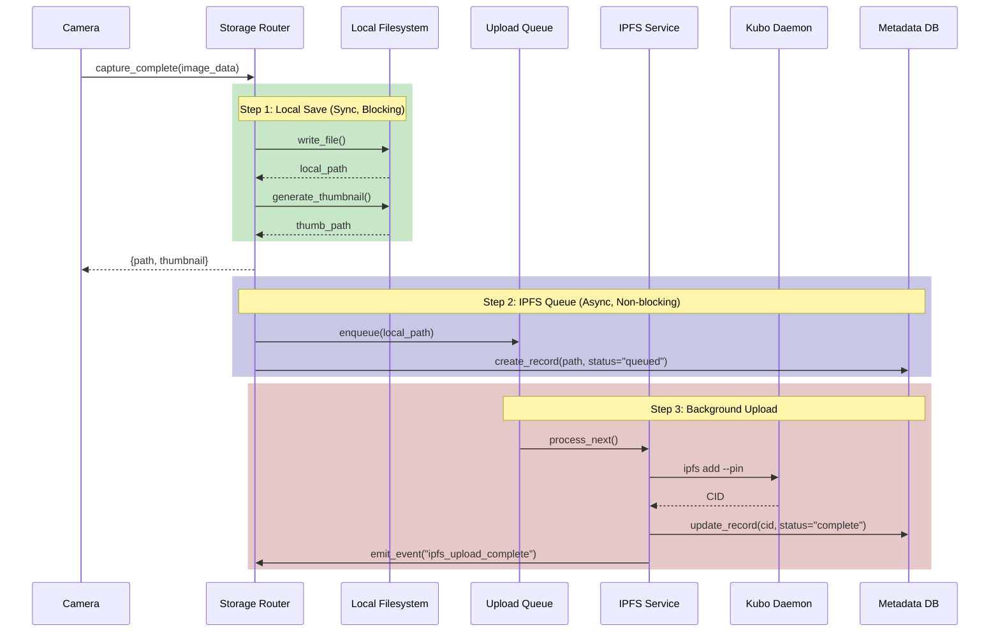
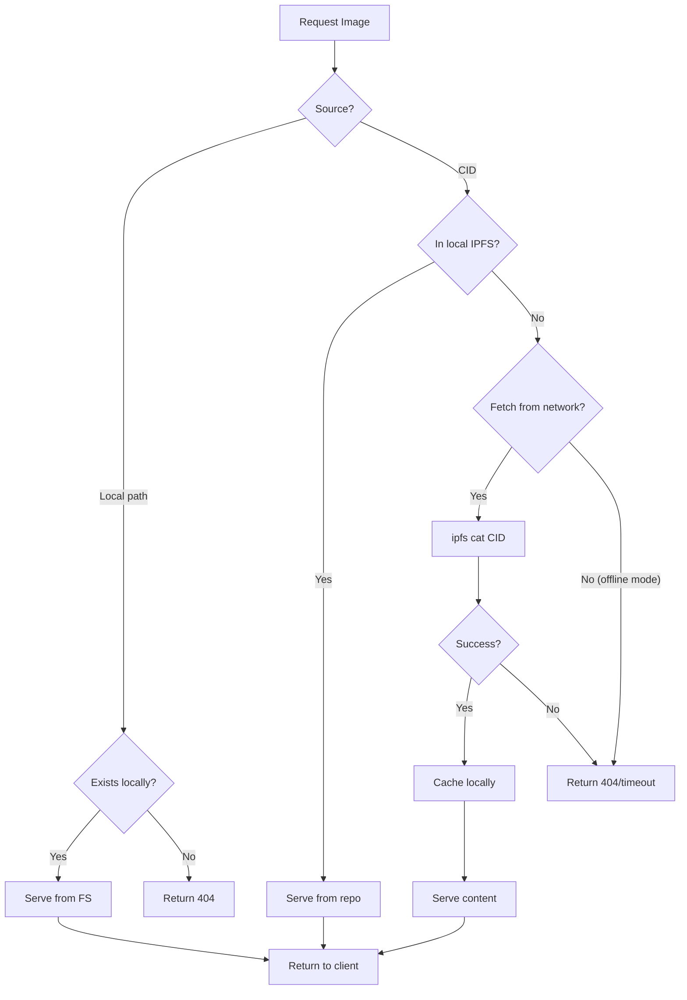
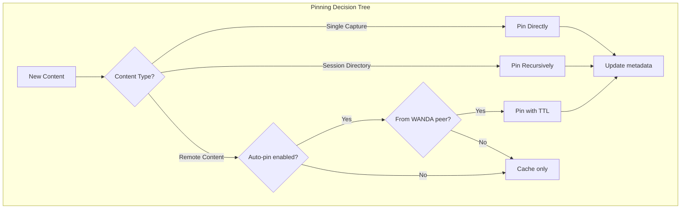
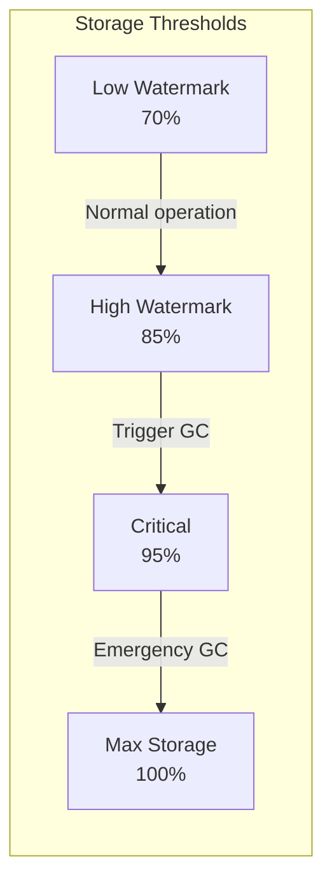
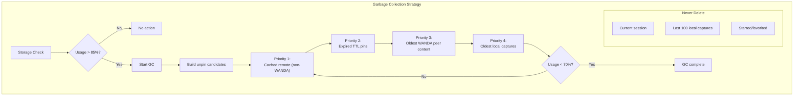
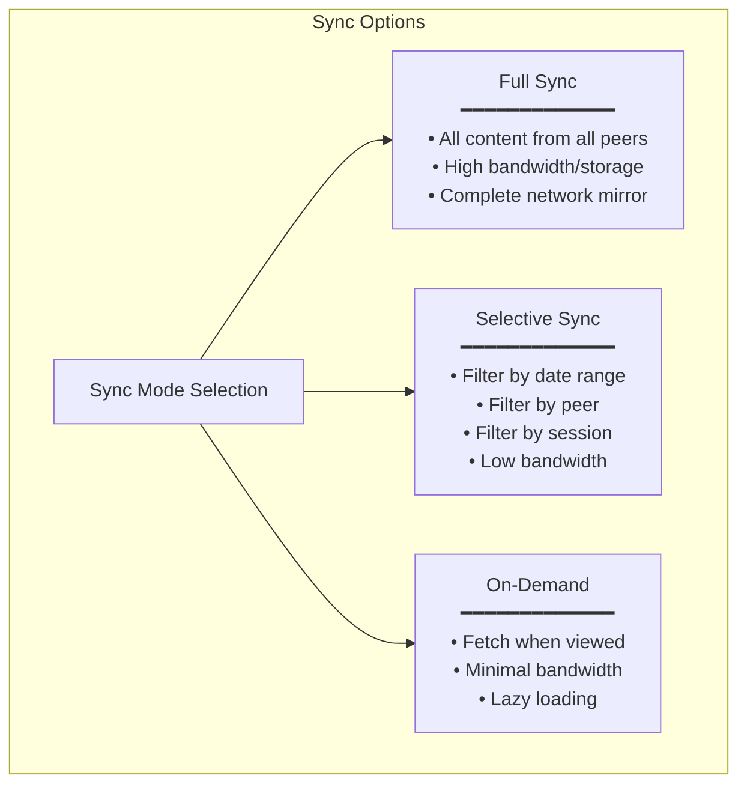
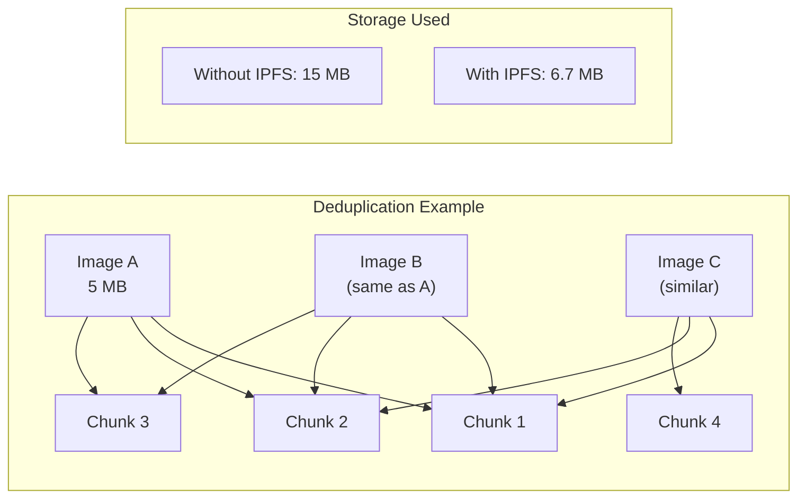
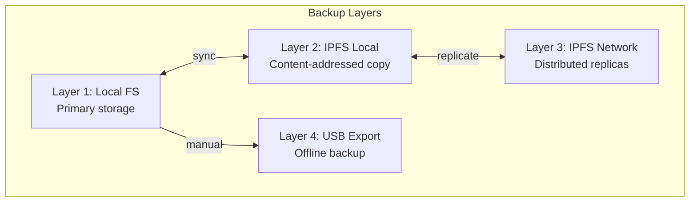
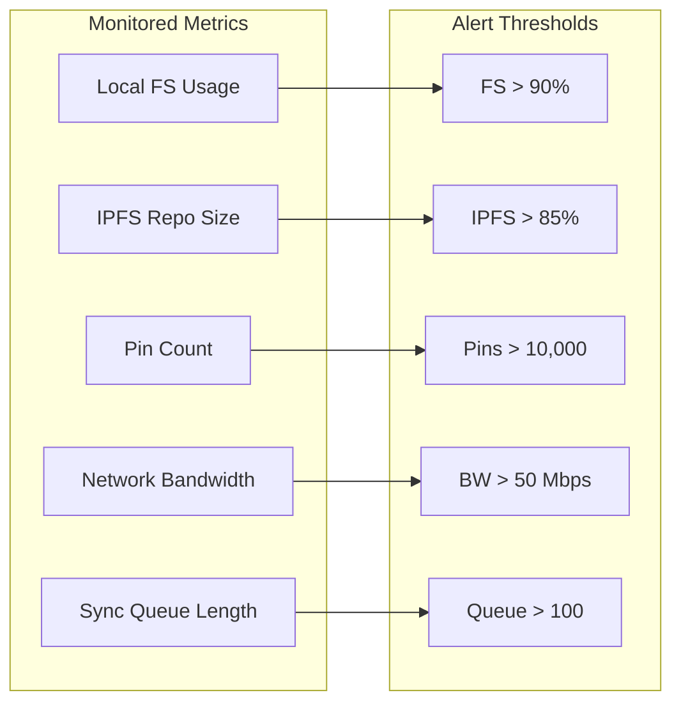

# WANDA IPFS Storage Strategy

## Overview

This document defines the storage strategy for WANDA's IPFS integration, covering local caching, pinning policies, garbage collection, and data lifecycle management.

## Storage Architecture



## Data Flow

### Capture Flow



### Retrieval Flow



## Directory Structure

### Local Filesystem

```
/captures/                          # Base capture directory
├── capture_0001.jpg               # Single captures
├── capture_0002.jpg
├── .thumbnails/                   # Thumbnail cache
│   ├── capture_0001_thumb.jpg
│   └── capture_0002_thumb.jpg
├── .ipfs_metadata.json            # IPFS mapping file
├── Session Name 1/                # Session directory
│   ├── image_0001.jpg
│   ├── image_0002.jpg
│   ├── session_metadata.json
│   └── .ipfs_session.json         # Session IPFS metadata
└── Session Name 2/
    └── ...
```

### IPFS Repository

```
~/.ipfs/                           # IPFS repository root
├── config                         # IPFS configuration
├── datastore/                     # Block storage
│   ├── 000001.log
│   └── MANIFEST-000002
├── keystore/                      # IPFS/IPNS keys
│   └── wanda-node                 # Node's IPNS key
└── version
```

## Metadata Schema

### Capture IPFS Metadata

```json
// /captures/.ipfs_metadata.json
{
  "version": "1.0",
  "node_id": "12D3KooW...",
  "ipns_name": "k51qzi5uqu...",
  "last_updated": "2025-01-15T10:30:00Z",
  "captures": {
    "capture_0001.jpg": {
      "cid": "bafybeigdyrzt5sfp7udm7hu76uh7y26nf3efuylqabf3oclgtqy55fbzdi",
      "size_bytes": 5242880,
      "added_at": "2025-01-15T09:00:00Z",
      "pinned": true,
      "replicas": 3
    },
    "capture_0002.jpg": {
      "cid": "QmXnnyufdzAWL5CqZ2RnSNgPbvCc1ALT73s6epPrRnZ1Xy",
      "size_bytes": 4718592,
      "added_at": "2025-01-15T09:15:00Z",
      "pinned": true,
      "replicas": 1
    }
  }
}
```

### Session IPFS Metadata

```json
// /captures/Moon Session/.ipfs_session.json
{
  "version": "1.0",
  "session_name": "Moon Session",
  "session_cid": "bafybeihdwdcefgh4dqkjv67uzcmw7ojee6xedzdetojuzjevtenxquvyku",
  "created_at": "2025-01-15T08:00:00Z",
  "completed_at": "2025-01-15T10:30:00Z",
  "ipns_name": "k51qzi5uqu...",
  "total_images": 50,
  "total_size_bytes": 262144000,
  "images": {
    "image_0001.jpg": {
      "cid": "bafybeigdyrzt5sfp7udm7hu76uh7y26nf3efuylqabf3oclgtqy55fbzdi",
      "size_bytes": 5242880
    }
  }
}
```

## Pinning Policies



### Policy Configuration

```python
# ipfs/config.py

PINNING_POLICIES = {
    # Local captures: always pin
    "local_captures": {
        "auto_pin": True,
        "pin_type": "direct",
        "priority": "high"
    },
    
    # Session directories: recursive pin
    "sessions": {
        "auto_pin": True,
        "pin_type": "recursive",
        "priority": "high"
    },
    
    # Content from WANDA peers: pin with TTL
    "wanda_peers": {
        "auto_pin": True,
        "pin_type": "direct",
        "ttl_days": 30,  # Auto-unpin after 30 days
        "priority": "medium"
    },
    
    # Content from unknown sources: cache only
    "unknown": {
        "auto_pin": False,
        "cache_only": True,
        "priority": "low"
    }
}
```

## Garbage Collection

### Storage Limits



### GC Strategy



### GC Configuration

```python
# ipfs/config.py

GARBAGE_COLLECTION = {
    # Storage thresholds (percentage of max storage)
    "low_watermark": 0.70,      # Target after GC
    "high_watermark": 0.85,     # Trigger GC
    "critical_threshold": 0.95, # Emergency GC
    
    # Maximum storage (bytes)
    "max_storage": 10 * 1024**3,  # 10 GB
    
    # Protection rules
    "protect_recent_days": 7,     # Don't GC content newer than 7 days
    "protect_local_count": 100,   # Keep at least 100 local captures
    "protect_starred": True,      # Never GC starred content
    
    # Schedule
    "auto_gc_enabled": True,
    "gc_schedule": "0 3 * * *",   # 3 AM daily
    "gc_on_storage_full": True
}
```

## Sync Strategies

### Full Sync vs. Selective Sync



### Sync Configuration

```python
# ipfs/config.py

SYNC_STRATEGIES = {
    "mode": "selective",  # "full", "selective", "on_demand"
    
    "selective": {
        # Time-based filters
        "sync_recent_days": 30,
        
        # Source filters
        "sync_from_nodes": ["all"],  # or specific node IDs
        
        # Content filters
        "sync_sessions": True,
        "sync_singles": True,
        
        # Bandwidth limits
        "max_bandwidth_mbps": 10,
        "sync_schedule": "*/15 * * * *",  # Every 15 minutes
    },
    
    "on_demand": {
        "cache_fetched": True,
        "cache_ttl_hours": 24,
        "prefetch_thumbnails": True
    }
}
```

## Storage Optimization

### Deduplication

IPFS automatically deduplicates content at the block level:



### Compression

| Content Type | Compression | Reason |
|--------------|-------------|--------|
| JPEG images | None | Already compressed |
| RAW images | Optional zstd | Large files benefit |
| JSON metadata | gzip | Small, highly compressible |
| Session directories | None | Mixed content |

## Backup and Recovery

### Backup Strategy



### Recovery Scenarios

| Scenario | Recovery Method |
|----------|-----------------|
| SD card corruption | Restore from IPFS (if CIDs known) |
| Accidental deletion | Unpin → Re-add from backup |
| Node failure | Sync from network peers |
| Network isolation | Continue with local storage |

### Export Command

```bash
# Export session to USB for offline backup
wanda-export --session "Moon Session" --destination /media/usb/backup/

# This creates:
# /media/usb/backup/Moon Session/
# ├── images/
# ├── metadata.json
# └── ipfs_manifest.json  # Contains all CIDs for re-import
```

## Monitoring and Alerts

### Storage Metrics



### Alert Configuration

```python
# ipfs/config.py

STORAGE_ALERTS = {
    "local_fs_warning": 0.80,
    "local_fs_critical": 0.90,
    
    "ipfs_repo_warning": 0.75,
    "ipfs_repo_critical": 0.85,
    
    "upload_queue_warning": 50,
    "upload_queue_critical": 100,
    
    "alert_methods": ["websocket", "log"],
    "alert_cooldown_minutes": 30
}
```

## Performance Considerations

### Raspberry Pi Optimizations

| Optimization | Setting | Reason |
|--------------|---------|--------|
| Reduce connections | LowWater: 50, HighWater: 100 | Memory constraints |
| Limit DHT | dhtclient mode | CPU usage |
| Async uploads | Background queue | Non-blocking captures |
| Lazy loading | On-demand fetch | Bandwidth conservation |
| Streaming | Chunk-based read/write | Memory efficiency |

### I/O Recommendations

```python
# Best practices for Raspberry Pi

# Use async I/O for IPFS operations
async def add_to_ipfs(file_path: str) -> str:
    """Non-blocking IPFS add."""
    async with aioipfs.AsyncIPFS() as client:
        result = await client.add(file_path)
        return result['Hash']

# Limit concurrent operations
IPFS_CONCURRENT_OPS = 2  # Max 2 simultaneous adds/gets

# Use memory-mapped files for large images
def read_large_file(path: str):
    with open(path, 'rb') as f:
        with mmap.mmap(f.fileno(), 0, access=mmap.ACCESS_READ) as mm:
            return mm.read()
```

---

**Next**: See [network-topology.md](./network-topology.md) for distributed network design.

