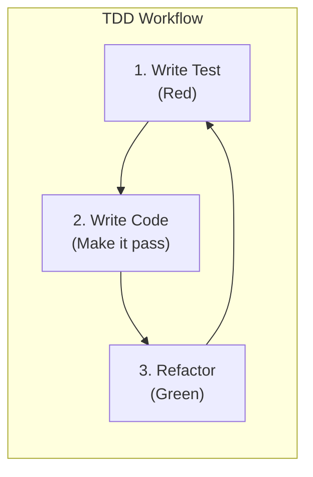
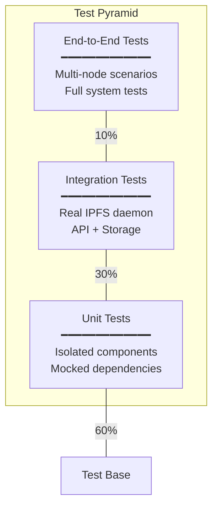

# WANDA IPFS Testing Strategy

## Overview

This document outlines the testing strategy for IPFS integration in WANDA, following the project's TDD (Test-Driven Development) methodology and maintaining the 85% code coverage requirement.

## Testing Philosophy



### Key Principles

1. **Tests First**: Write tests before implementation
2. **Mock Hardware/Network**: IPFS daemon should be mockable
3. **Isolation**: Each test should be independent
4. **Coverage**: Minimum 85% for all new IPFS code
5. **Real-World Scenarios**: Include integration tests with actual IPFS

## Test Categories



## Directory Structure

```
tests/
├── test_ipfs/
│   ├── __init__.py
│   ├── conftest.py              # Shared fixtures
│   ├── test_client.py           # IPFSClient unit tests
│   ├── test_service.py          # IPFSService unit tests
│   ├── test_storage_router.py   # StorageRouter unit tests
│   ├── test_models.py           # Data model tests
│   ├── test_config.py           # Configuration tests
│   ├── integration/
│   │   ├── __init__.py
│   │   ├── conftest.py          # Integration fixtures
│   │   ├── test_daemon.py       # Real daemon tests
│   │   ├── test_capture_flow.py # Capture → IPFS flow
│   │   └── test_session_flow.py # Session → DAG flow
│   └── e2e/
│       ├── __init__.py
│       ├── conftest.py          # E2E fixtures
│       ├── test_multi_node.py   # Multi-node scenarios
│       └── test_sync.py         # Content sync tests
├── mocks/
│   └── mock_ipfs.py             # IPFS mock implementation
```

## Unit Tests

### IPFSClient Tests

```python
# tests/test_ipfs/test_client.py

import pytest
from unittest.mock import patch, MagicMock
from ipfs.client import IPFSClient
from ipfs.models import CID

class TestIPFSClient:
    """Unit tests for IPFSClient HTTP wrapper."""
    
    @pytest.fixture
    def client(self):
        """Create client with mocked HTTP session."""
        with patch('ipfs.client.requests.Session') as mock_session:
            client = IPFSClient(api_url="http://localhost:5001")
            client._session = mock_session.return_value
            yield client
    
    def test_init_default_url(self):
        """Test client initializes with default API URL."""
        # Arrange
        with patch('ipfs.client.requests.Session'):
            # Act
            client = IPFSClient()
            
            # Assert
            assert client.api_url == "http://127.0.0.1:5001"
    
    def test_add_file_returns_cid(self, client):
        """Test adding file returns correct CID."""
        # Arrange
        mock_response = MagicMock()
        mock_response.json.return_value = {
            "Hash": "QmXnnyufdzAWL5CqZ2RnSNgPbvCc1ALT73s6epPrRnZ1Xy",
            "Size": "1024"
        }
        client._session.post.return_value = mock_response
        
        # Act
        cid = client.add("/path/to/file.jpg")
        
        # Assert
        assert str(cid) == "QmXnnyufdzAWL5CqZ2RnSNgPbvCc1ALT73s6epPrRnZ1Xy"
        client._session.post.assert_called_once()
    
    def test_add_file_with_pin(self, client):
        """Test adding file with pinning enabled."""
        # Arrange
        mock_response = MagicMock()
        mock_response.json.return_value = {"Hash": "QmTest..."}
        client._session.post.return_value = mock_response
        
        # Act
        client.add("/path/to/file.jpg", pin=True)
        
        # Assert
        call_args = client._session.post.call_args
        assert "pin=true" in str(call_args)
    
    def test_cat_returns_bytes(self, client):
        """Test cat operation returns file bytes."""
        # Arrange
        expected_content = b"image binary data"
        mock_response = MagicMock()
        mock_response.content = expected_content
        client._session.post.return_value = mock_response
        
        # Act
        content = client.cat("QmTest...")
        
        # Assert
        assert content == expected_content
    
    def test_cat_not_found_raises(self, client):
        """Test cat raises exception for unknown CID."""
        # Arrange
        mock_response = MagicMock()
        mock_response.status_code = 500
        mock_response.raise_for_status.side_effect = Exception("Not found")
        client._session.post.return_value = mock_response
        
        # Act & Assert
        with pytest.raises(Exception):
            client.cat("QmNonexistent...")
    
    def test_pin_add_success(self, client):
        """Test pinning content."""
        # Arrange
        mock_response = MagicMock()
        mock_response.json.return_value = {"Pins": ["QmTest..."]}
        client._session.post.return_value = mock_response
        
        # Act
        result = client.pin_add("QmTest...")
        
        # Assert
        assert result is True
    
    def test_connection_error_retry(self, client):
        """Test retry logic on connection failure."""
        # Arrange
        client._session.post.side_effect = [
            ConnectionError("Connection refused"),
            ConnectionError("Connection refused"),
            MagicMock(json=lambda: {"Hash": "QmTest..."})
        ]
        
        # Act
        result = client.add("/path/to/file.jpg", max_retries=3)
        
        # Assert
        assert result is not None
        assert client._session.post.call_count == 3
```

### IPFSService Tests

```python
# tests/test_ipfs/test_service.py

import pytest
from unittest.mock import MagicMock, patch
from ipfs.service import IPFSService
from ipfs.models import CID, UploadStatus

class TestIPFSService:
    """Unit tests for high-level IPFS service."""
    
    @pytest.fixture
    def mock_client(self):
        """Create mocked IPFS client."""
        return MagicMock()
    
    @pytest.fixture
    def service(self, mock_client):
        """Create service with mocked client."""
        with patch('ipfs.service.IPFSClient', return_value=mock_client):
            service = IPFSService()
            service.client = mock_client
            yield service
    
    def test_add_file_calls_client(self, service, mock_client):
        """Test add_file delegates to client."""
        # Arrange
        mock_client.add.return_value = CID("QmTest...")
        
        # Act
        cid = service.add_file("/path/to/image.jpg")
        
        # Assert
        mock_client.add.assert_called_once_with("/path/to/image.jpg", pin=True)
        assert str(cid) == "QmTest..."
    
    def test_add_file_updates_metadata(self, service, mock_client):
        """Test add_file updates metadata store."""
        # Arrange
        mock_client.add.return_value = CID("QmTest...")
        
        # Act
        with patch.object(service, '_update_metadata') as mock_update:
            service.add_file("/path/to/image.jpg")
            
            # Assert
            mock_update.assert_called_once()
    
    def test_is_daemon_running_true(self, service, mock_client):
        """Test daemon status check when running."""
        # Arrange
        mock_client.id.return_value = {"ID": "12D3KooW..."}
        
        # Act
        result = service.is_daemon_running()
        
        # Assert
        assert result is True
    
    def test_is_daemon_running_false(self, service, mock_client):
        """Test daemon status check when not running."""
        # Arrange
        mock_client.id.side_effect = ConnectionError()
        
        # Act
        result = service.is_daemon_running()
        
        # Assert
        assert result is False
    
    def test_get_stats_returns_dict(self, service, mock_client):
        """Test get_stats returns complete statistics."""
        # Arrange
        mock_client.repo_stat.return_value = {
            "RepoSize": 1024 * 1024 * 100,
            "NumObjects": 1000
        }
        mock_client.swarm_peers.return_value = [{"Peer": "1"}, {"Peer": "2"}]
        mock_client.pin_ls.return_value = {"Keys": {"Qm1": {}, "Qm2": {}}}
        
        # Act
        stats = service.get_stats()
        
        # Assert
        assert "storage" in stats
        assert "network" in stats
        assert "pins" in stats
        assert stats["network"]["peers_connected"] == 2
```

### Storage Router Tests

```python
# tests/test_ipfs/test_storage_router.py

import pytest
from unittest.mock import MagicMock, patch, AsyncMock
from ipfs.router import StorageRouter

class TestStorageRouter:
    """Unit tests for storage routing logic."""
    
    @pytest.fixture
    def mock_ipfs_service(self):
        return MagicMock()
    
    @pytest.fixture
    def router(self, mock_ipfs_service):
        with patch('ipfs.router.IPFSService', return_value=mock_ipfs_service):
            router = StorageRouter(base_dir="/captures")
            router.ipfs_service = mock_ipfs_service
            yield router
    
    def test_save_saves_locally_first(self, router):
        """Test that save always writes to local filesystem first."""
        # Arrange
        image_data = b"fake image data"
        
        # Act
        with patch('builtins.open', MagicMock()):
            result = router.save("test.jpg", image_data)
        
        # Assert
        assert result["local_path"] is not None
    
    def test_save_queues_for_ipfs(self, router):
        """Test that save queues file for IPFS upload."""
        # Arrange
        image_data = b"fake image data"
        
        # Act
        with patch('builtins.open', MagicMock()):
            router.save("test.jpg", image_data)
        
        # Assert
        assert router.upload_queue.qsize() > 0
    
    def test_save_works_without_ipfs(self, router, mock_ipfs_service):
        """Test graceful degradation when IPFS unavailable."""
        # Arrange
        mock_ipfs_service.is_daemon_running.return_value = False
        image_data = b"fake image data"
        
        # Act
        with patch('builtins.open', MagicMock()):
            result = router.save("test.jpg", image_data)
        
        # Assert
        assert result["local_path"] is not None
        assert result["cid"] is None
        assert result["ipfs_status"] == "daemon_unavailable"
    
    def test_process_queue_uploads_files(self, router, mock_ipfs_service):
        """Test queue processor uploads pending files."""
        # Arrange
        mock_ipfs_service.add_file.return_value = CID("QmTest...")
        router.upload_queue.put("/captures/test.jpg")
        
        # Act
        router._process_queue_item()
        
        # Assert
        mock_ipfs_service.add_file.assert_called_once_with("/captures/test.jpg")
```

## Integration Tests

### IPFS Daemon Integration

```python
# tests/test_ipfs/integration/test_daemon.py

import pytest
import subprocess
import time
from ipfs.client import IPFSClient
from ipfs.service import IPFSService

@pytest.fixture(scope="module")
def ipfs_daemon():
    """Start IPFS daemon for integration tests."""
    # Start daemon
    process = subprocess.Popen(
        ["ipfs", "daemon", "--offline"],
        stdout=subprocess.PIPE,
        stderr=subprocess.PIPE
    )
    time.sleep(5)  # Wait for daemon to start
    
    yield process
    
    # Cleanup
    process.terminate()
    process.wait()

@pytest.fixture
def client(ipfs_daemon):
    """Create real IPFS client."""
    return IPFSClient()

class TestIPFSDaemonIntegration:
    """Integration tests with real IPFS daemon."""
    
    @pytest.mark.integration
    def test_add_and_retrieve_file(self, client, tmp_path):
        """Test adding and retrieving a file through IPFS."""
        # Arrange
        test_file = tmp_path / "test.txt"
        test_file.write_text("Hello IPFS!")
        
        # Act
        cid = client.add(str(test_file))
        content = client.cat(str(cid))
        
        # Assert
        assert content == b"Hello IPFS!"
    
    @pytest.mark.integration
    def test_add_image_file(self, client, tmp_path):
        """Test adding an image file."""
        # Arrange
        test_image = tmp_path / "test.jpg"
        # Create a minimal valid JPEG
        test_image.write_bytes(b'\xff\xd8\xff\xe0' + b'\x00' * 100)
        
        # Act
        cid = client.add(str(test_image))
        
        # Assert
        assert cid is not None
        assert str(cid).startswith("Qm") or str(cid).startswith("bafy")
    
    @pytest.mark.integration
    def test_pin_and_unpin(self, client, tmp_path):
        """Test pinning and unpinning content."""
        # Arrange
        test_file = tmp_path / "test.txt"
        test_file.write_text("Pin me!")
        cid = client.add(str(test_file), pin=False)
        
        # Act
        client.pin_add(str(cid))
        pins = client.pin_ls()
        
        # Assert
        assert str(cid) in str(pins)
        
        # Cleanup
        client.pin_rm(str(cid))
    
    @pytest.mark.integration
    def test_directory_operations(self, client, tmp_path):
        """Test adding a directory."""
        # Arrange
        session_dir = tmp_path / "session"
        session_dir.mkdir()
        (session_dir / "image1.jpg").write_bytes(b'\xff\xd8\xff\xe0' + b'\x00' * 50)
        (session_dir / "image2.jpg").write_bytes(b'\xff\xd8\xff\xe0' + b'\x00' * 50)
        (session_dir / "metadata.json").write_text('{"name": "test"}')
        
        # Act
        result = client.add_directory(str(session_dir))
        
        # Assert
        assert result["cid"] is not None
        assert result["file_count"] == 3
```

### Capture Flow Integration

```python
# tests/test_ipfs/integration/test_capture_flow.py

import pytest
from unittest.mock import MagicMock
from ipfs.router import StorageRouter
from ipfs.service import IPFSService

@pytest.fixture(scope="module")
def ipfs_service(ipfs_daemon):
    """Create real IPFS service."""
    return IPFSService()

class TestCaptureFlowIntegration:
    """Integration tests for capture → IPFS flow."""
    
    @pytest.mark.integration
    def test_capture_to_ipfs_flow(self, ipfs_service, tmp_path):
        """Test complete flow from capture to IPFS publication."""
        # Arrange
        router = StorageRouter(base_dir=str(tmp_path))
        router.ipfs_service = ipfs_service
        image_data = b'\xff\xd8\xff\xe0' + b'\x00' * 1000  # Fake JPEG
        
        # Act
        result = router.save("capture_0001.jpg", image_data)
        
        # Wait for async upload
        router.wait_for_uploads(timeout=10)
        
        # Assert
        assert result["local_path"].endswith("capture_0001.jpg")
        
        # Verify CID was generated
        metadata = router.get_metadata("capture_0001.jpg")
        assert metadata["cid"] is not None
    
    @pytest.mark.integration
    def test_session_directory_to_dag(self, ipfs_service, tmp_path):
        """Test creating session directory as IPFS DAG."""
        # Arrange
        session_dir = tmp_path / "Moon Session"
        session_dir.mkdir()
        
        for i in range(5):
            (session_dir / f"image_{i:04d}.jpg").write_bytes(
                b'\xff\xd8\xff\xe0' + b'\x00' * 100
            )
        (session_dir / "session_metadata.json").write_text(
            '{"name": "Moon Session", "total_images": 5}'
        )
        
        # Act
        result = ipfs_service.add_directory(str(session_dir))
        
        # Assert
        assert result["cid"] is not None
        
        # Verify we can list directory contents
        contents = ipfs_service.ls(result["cid"])
        assert len(contents) == 6  # 5 images + metadata
```

## End-to-End Tests

### Multi-Node Tests

```python
# tests/test_ipfs/e2e/test_multi_node.py

import pytest
import subprocess
import time
import tempfile
from pathlib import Path

@pytest.fixture(scope="module")
def node_pair():
    """Create two IPFS nodes for testing."""
    # Create temporary directories for each node
    node1_dir = tempfile.mkdtemp(prefix="ipfs_node1_")
    node2_dir = tempfile.mkdtemp(prefix="ipfs_node2_")
    
    # Initialize nodes
    subprocess.run(["ipfs", "init"], env={"IPFS_PATH": node1_dir})
    subprocess.run(["ipfs", "init"], env={"IPFS_PATH": node2_dir})
    
    # Configure different ports
    # Node 1: API 5001, Gateway 8080, Swarm 4001
    # Node 2: API 5002, Gateway 8081, Swarm 4002
    
    # Start daemons
    node1_proc = subprocess.Popen(
        ["ipfs", "daemon"],
        env={"IPFS_PATH": node1_dir}
    )
    node2_proc = subprocess.Popen(
        ["ipfs", "daemon"],
        env={"IPFS_PATH": node2_dir}
    )
    
    time.sleep(10)  # Wait for daemons
    
    yield {
        "node1": {"dir": node1_dir, "api": "http://127.0.0.1:5001"},
        "node2": {"dir": node2_dir, "api": "http://127.0.0.1:5002"}
    }
    
    # Cleanup
    node1_proc.terminate()
    node2_proc.terminate()

class TestMultiNodeE2E:
    """End-to-end tests with multiple IPFS nodes."""
    
    @pytest.mark.e2e
    def test_content_propagation(self, node_pair):
        """Test content added to one node is accessible from another."""
        # Arrange
        from ipfs.client import IPFSClient
        
        client1 = IPFSClient(api_url=node_pair["node1"]["api"])
        client2 = IPFSClient(api_url=node_pair["node2"]["api"])
        
        # Connect nodes
        node1_id = client1.id()["ID"]
        node1_addrs = client1.id()["Addresses"]
        client2.swarm_connect(node1_addrs[0])
        
        # Act
        # Add content to node 1
        test_content = b"Hello from node 1!"
        with tempfile.NamedTemporaryFile(delete=False) as f:
            f.write(test_content)
            temp_path = f.name
        
        cid = client1.add(temp_path)
        
        # Try to retrieve from node 2
        time.sleep(2)  # Allow propagation
        content = client2.cat(str(cid))
        
        # Assert
        assert content == test_content
    
    @pytest.mark.e2e
    def test_pubsub_announcement(self, node_pair):
        """Test PubSub message delivery between nodes."""
        # Arrange
        from ipfs.client import IPFSClient
        import threading
        
        client1 = IPFSClient(api_url=node_pair["node1"]["api"])
        client2 = IPFSClient(api_url=node_pair["node2"]["api"])
        
        received_messages = []
        
        def subscriber():
            for msg in client2.pubsub_subscribe("/wanda/test"):
                received_messages.append(msg)
                break  # Just get first message
        
        # Start subscriber thread
        sub_thread = threading.Thread(target=subscriber)
        sub_thread.start()
        time.sleep(1)
        
        # Act
        client1.pubsub_publish("/wanda/test", "New capture: QmTest...")
        
        sub_thread.join(timeout=5)
        
        # Assert
        assert len(received_messages) == 1
        assert "QmTest" in str(received_messages[0])
```

## Mock IPFS Implementation

```python
# tests/mocks/mock_ipfs.py

from typing import Dict, List, Optional
from dataclasses import dataclass, field
import hashlib

@dataclass
class MockIPFSNode:
    """Mock IPFS node for testing without real daemon."""
    
    storage: Dict[str, bytes] = field(default_factory=dict)
    pins: Dict[str, str] = field(default_factory=dict)  # CID -> pin_type
    peers: List[str] = field(default_factory=list)
    
    def add(self, content: bytes, pin: bool = True) -> str:
        """Add content and return CID."""
        # Generate deterministic mock CID
        hash_bytes = hashlib.sha256(content).digest()
        cid = f"Qm{hash_bytes[:20].hex()}"
        
        self.storage[cid] = content
        if pin:
            self.pins[cid] = "recursive"
        
        return cid
    
    def cat(self, cid: str) -> bytes:
        """Retrieve content by CID."""
        if cid not in self.storage:
            raise FileNotFoundError(f"CID not found: {cid}")
        return self.storage[cid]
    
    def pin_add(self, cid: str, pin_type: str = "recursive") -> bool:
        """Pin content."""
        if cid not in self.storage:
            raise FileNotFoundError(f"CID not found: {cid}")
        self.pins[cid] = pin_type
        return True
    
    def pin_rm(self, cid: str) -> bool:
        """Unpin content."""
        if cid in self.pins:
            del self.pins[cid]
            return True
        return False
    
    def pin_ls(self) -> Dict[str, dict]:
        """List pins."""
        return {"Keys": {cid: {"Type": t} for cid, t in self.pins.items()}}
    
    def id(self) -> dict:
        """Return node identity."""
        return {
            "ID": "12D3KooWMockNode...",
            "AgentVersion": "mock/1.0.0",
            "Addresses": ["/ip4/127.0.0.1/tcp/4001"]
        }
    
    def swarm_peers(self) -> List[dict]:
        """Return connected peers."""
        return [{"Peer": p} for p in self.peers]
    
    def repo_stat(self) -> dict:
        """Return repository statistics."""
        total_size = sum(len(v) for v in self.storage.values())
        return {
            "RepoSize": total_size,
            "NumObjects": len(self.storage)
        }

class MockIPFSClient:
    """Mock IPFS client using MockIPFSNode."""
    
    def __init__(self, node: Optional[MockIPFSNode] = None):
        self.node = node or MockIPFSNode()
        self.api_url = "http://mock:5001"
    
    def add(self, file_path: str, pin: bool = True) -> str:
        with open(file_path, 'rb') as f:
            content = f.read()
        return self.node.add(content, pin)
    
    def cat(self, cid: str) -> bytes:
        return self.node.cat(cid)
    
    def pin_add(self, cid: str) -> bool:
        return self.node.pin_add(cid)
    
    def pin_rm(self, cid: str) -> bool:
        return self.node.pin_rm(cid)
    
    def pin_ls(self) -> dict:
        return self.node.pin_ls()
    
    def id(self) -> dict:
        return self.node.id()
    
    def swarm_peers(self) -> List[dict]:
        return self.node.swarm_peers()
    
    def repo_stat(self) -> dict:
        return self.node.repo_stat()
```

## Test Fixtures

```python
# tests/test_ipfs/conftest.py

import pytest
from tests.mocks.mock_ipfs import MockIPFSClient, MockIPFSNode

@pytest.fixture
def mock_ipfs_node():
    """Create a fresh mock IPFS node."""
    return MockIPFSNode()

@pytest.fixture
def mock_ipfs_client(mock_ipfs_node):
    """Create mock IPFS client."""
    return MockIPFSClient(node=mock_ipfs_node)

@pytest.fixture
def sample_image_data():
    """Create minimal valid JPEG data."""
    # JPEG header + minimal data
    return b'\xff\xd8\xff\xe0\x00\x10JFIF\x00\x01\x01\x00\x00\x01\x00\x01\x00\x00' + b'\x00' * 100 + b'\xff\xd9'

@pytest.fixture
def sample_session_dir(tmp_path, sample_image_data):
    """Create a sample session directory."""
    session = tmp_path / "Test Session"
    session.mkdir()
    
    for i in range(3):
        (session / f"image_{i:04d}.jpg").write_bytes(sample_image_data)
    
    (session / "session_metadata.json").write_text(
        '{"name": "Test Session", "total_images": 3}'
    )
    
    return session
```

## Coverage Configuration

```ini
# pytest.ini additions for IPFS tests

[pytest]
markers =
    integration: Integration tests requiring IPFS daemon
    e2e: End-to-end tests requiring multiple nodes

# Coverage configuration
[coverage:run]
source = ipfs
omit = 
    tests/*
    */__pycache__/*

[coverage:report]
fail_under = 85
show_missing = true
```

## CI/CD Integration

```yaml
# .github/workflows/test-ipfs.yml

name: IPFS Integration Tests

on:
  push:
    paths:
      - 'ipfs/**'
      - 'tests/test_ipfs/**'
  pull_request:
    paths:
      - 'ipfs/**'
      - 'tests/test_ipfs/**'

jobs:
  unit-tests:
    runs-on: ubuntu-latest
    steps:
      - uses: actions/checkout@v4
      
      - name: Set up Python
        uses: actions/setup-python@v5
        with:
          python-version: '3.11'
      
      - name: Install dependencies
        run: |
          pip install -r requirements.txt
          pip install pytest pytest-cov
      
      - name: Run unit tests
        run: |
          pytest tests/test_ipfs/ \
            --ignore=tests/test_ipfs/integration \
            --ignore=tests/test_ipfs/e2e \
            --cov=ipfs \
            --cov-report=term-missing \
            --cov-fail-under=85
  
  integration-tests:
    runs-on: ubuntu-latest
    steps:
      - uses: actions/checkout@v4
      
      - name: Install IPFS
        run: |
          wget https://dist.ipfs.tech/kubo/v0.25.0/kubo_v0.25.0_linux-amd64.tar.gz
          tar -xvzf kubo_v0.25.0_linux-amd64.tar.gz
          sudo ./kubo/install.sh
          ipfs init
      
      - name: Set up Python
        uses: actions/setup-python@v5
        with:
          python-version: '3.11'
      
      - name: Install dependencies
        run: pip install -r requirements.txt
      
      - name: Run integration tests
        run: |
          pytest tests/test_ipfs/integration/ -m integration -v
```

## Test Execution Commands

```bash
# Run all IPFS unit tests
pytest tests/test_ipfs/ --ignore=tests/test_ipfs/integration --ignore=tests/test_ipfs/e2e

# Run with coverage
pytest tests/test_ipfs/ --ignore=tests/test_ipfs/integration --ignore=tests/test_ipfs/e2e \
  --cov=ipfs --cov-report=term-missing --cov-report=html

# Run integration tests (requires IPFS daemon)
pytest tests/test_ipfs/integration/ -m integration -v

# Run end-to-end tests (requires multiple nodes)
pytest tests/test_ipfs/e2e/ -m e2e -v

# Run all tests
pytest tests/test_ipfs/ -v --tb=short
```

---

This completes the IPFS documentation suite. The testing strategy follows WANDA's TDD methodology and ensures comprehensive coverage for the IPFS integration.

